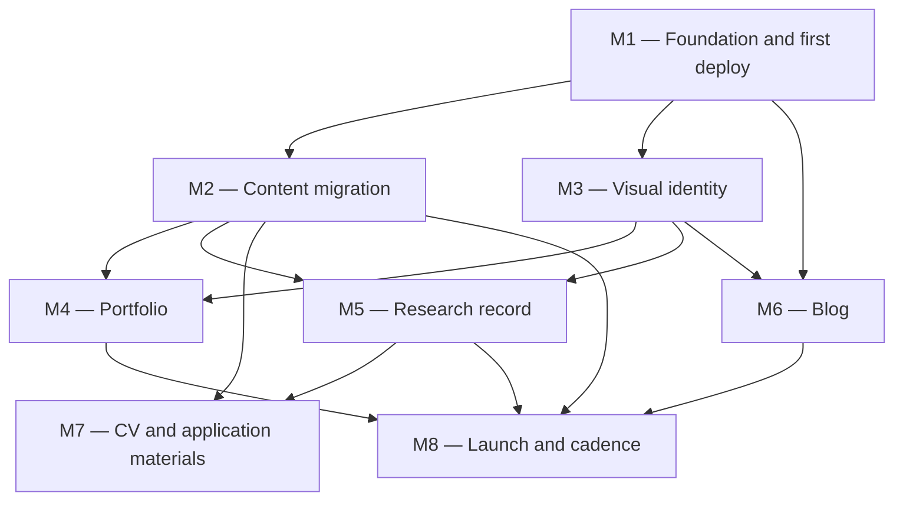

<!--
File: docs/GITHUB_PROJECT.md

This file is partially generated by scripts/python/gh_project_render.py.
Manual prose (milestone descriptions, exit criteria, mermaid graphs)
is hand-edited.  Issue listings between

    BEGIN GENERATED: milestone-N
    ...
    END GENERATED: milestone-N

markers are regenerated from GitHub state by `make project-plan`;
edits to those regions will be overwritten on the next render.
-->

# williamdemeo.org — GitHub Project Roadmap

**Project Title**:  williamdemeo.org 2.0 — Consolidation, Migration to MkDocs, Portfolio, and Blog

**Repository**:  `williamdemeo/williamdemeo.github.io`

**Date**:  2026-07-29

---

## Summary

Rebuild the personal website in eight milestones: consolidate two abandoned sites and stand up a deployed MkDocs skeleton (M1), migrate and triage all legacy content (M2), design a modern visual identity (M3), build a portfolio of flagship work (M4), publish the research record from structured sources (M5), stand up a blog with an authoring workflow that removes the friction that killed the last attempt (M6), single-source the CV and application materials (M7), and cut `williamdemeo.org` over to GitHub Pages with quality gates and a sustainable cadence (M8).

---

## Description

Two personal sites exist and neither is maintained.  The GitHub repository `williamdemeo/williamdemeo.github.io` holds the *generated output* of an Octopress site whose last content commit was December 2017; the Markdown sources are gone.  The GitLab repository `williamdemeo/williamdemeo.gitlab.io` holds a Zola site ("WJD Open Notebook") that serves `williamdemeo.org` today, pinned to Zola v0.5.0 (2018) with a hand-rolled theme.  Its most recent post is from November 2021.

This project consolidates both into a single MkDocs site in the GitHub repository, on the theory that the tooling has to be something the author actually enjoys using — MkDocs is already in daily use on two other actively maintained sites, and Zola is not.  The work is sequenced so that a deployed, presentable site exists at the end of M1 rather than at the end of the project; every later milestone improves something already live.

The site has a specific audience in mind.  The author is a mathematician (PhD, universal algebra and lattice theory) working as a formal verification engineer, and is seeking a research scientist or research engineer role in model development, training, or formal methods.  The content architecture is chosen accordingly: recent work at the intersection of AI and interactive theorem proving leads, deep formalization work (agda-algebras, the Cardano ledger specification) supplies the evidence of rigor and scale, and the academic record supplies credentials without dominating the page.  A blog is not decoration here — for this audience, sustained public technical writing is among the strongest available signals, which is why M6 treats *authoring friction* as the primary engineering problem rather than an afterthought.

---

## Repository strategy

The recommendation is **to keep `williamdemeo/williamdemeo.github.io` and rebuild inside it**, rather than creating a new repository and archiving this one.

The reason is that `<username>.github.io` is not an ordinary repository name.  GitHub Pages treats it as the *user site*: it serves from the repository root at `https://williamdemeo.github.io` with no path prefix, and it is the only repository that can do so.  Building elsewhere means either accepting a `/project-name/` path prefix or attaching a custom domain to a project page — extra indirection that buys nothing.  Keeping this repository also preserves its history and whatever inbound links point at `williamdemeo.github.io/*`.

The cost of keeping it is that the repository currently contains 22 MB of generated Octopress HTML, CSS, and theme assets across 512 files, plus eight years of `Site updated at ...` deploy commits.  That is a presentation problem for a repository a hiring manager may well open, but it is solved by cleaning the working tree, not by abandoning the repository: `git` retains the old content, and a tag makes it trivially recoverable.  M1-2 covers this.

The GitLab repository should be imported rather than mirrored.  Its useful content is Markdown under `content/`, plus images under `static/`; its Zola theme, its jQuery/elasticlunr search bundle, and its `.gitlab-ci.yml` are all being replaced.  M2-1 covers the import mechanics and the question of whether to preserve GitLab commit history (recommendation: import the working tree in a single commit that records the source SHA, and keep the GitLab repository itself as the archive of that history — a `git subtree` merge is available if full history in-tree turns out to matter, but it is not worth the complexity up front).

Three sequencing constraints are worth stating explicitly.

+  **`williamdemeo.org` must keep working throughout.**  It currently resolves to GitLab Pages.  The new site should be built, deployed, and reviewed at `williamdemeo.github.io` first; the DNS cutover (M8-1) happens only once the replacement is genuinely better than what it replaces.
+  **URL preservation is a real constraint, not a nicety.**  The CV, published papers, talk slides, and the ualib.org documentation all link into these two sites.  M2-6 builds the redirect map before anything is deleted.
+  **The site should not read as a job application.**  It should read as the working site of a serious researcher-engineer whose interests happen to line up with the roles being sought.  Issues tagged `career` exist to keep that alignment deliberate, not to put it on the page.

---

## Note on the project tooling

`scripts/python/gh_project_populate.py` required two fixes before this plan could be used, both committed alongside this file.

+  Issue titles were being created without the `[MN-k]` prefix that `scripts/python/gh_project_render.py` uses to recognize planning issues.  Left unfixed, `make project-plan` would have silently rendered every milestone as empty, and a second `populate` run would have duplicated every issue instead of being idempotent.
+  The `<!-- END GENERATED: milestone-N -->` markers in this file were being swept into the body of each milestone's final issue, pushed to GitHub, and would have been read back into the middle of a generated region — closing that region early on the next render.

---

## Labels

- `milestone-1-foundation` (0075ca) — Milestone 1: Foundation, consolidation, and first deploy.
- `milestone-2-migration` (0075ca) — Milestone 2: Content migration and triage.
- `milestone-3-design` (0075ca) — Milestone 3: Visual identity and design system.
- `milestone-4-portfolio` (5319e7) — Milestone 4: Portfolio of flagship work.
- `milestone-5-research` (5319e7) — Milestone 5: Publications, talks, and teaching record.
- `milestone-6-blog` (5319e7) — Milestone 6: Blog engine, workflow, and first posts.
- `milestone-7-cv` (5319e7) — Milestone 7: CV and application materials.
- `milestone-8-launch` (5319e7) — Milestone 8: Domain cutover, quality gates, and cadence.
- `infrastructure` (fbca04) — Build system, tooling, and repository plumbing.
- `ci` (fbca04) — GitHub Actions and continuous deployment.
- `content` (0e8a16) — Migrating, triaging, or restructuring existing content.
- `documentation` (0e8a16) — README, ADRs, and repository documentation.
- `writing` (0e8a16) — Requires substantial new prose.
- `design` (d4c5f9) — Visual design and front-end work.
- `accessibility` (c2e0c6) — Accessibility and performance.
- `seo` (bfd4f2) — Discoverability, metadata, and structured data.
- `decision` (c5def5) — Needs a decision before implementation can start.
- `career` (e99695) — Directly serves the research-role application goal.
- `automation` (fef2c0) — Scripts and generators that remove manual steps.
- `good first issue` (7057ff) — Small, self-contained, good for a spare hour.

---

## Milestones

### Milestone 1 — Foundation, consolidation, and first deploy (BLOCKING)

**Description:**

Turn a repository full of stale generated HTML into a deployed MkDocs site, and unblock every other milestone.  Decide and execute the repository strategy; retire the Octopress output without breaking its URLs; stand up MkDocs Material with pinned dependencies and a `make serve` loop; wire GitHub Actions to build with `--strict` on pull requests and deploy to GitHub Pages on `main`.

The milestone deliberately ends with a *live site*, not a scaffold.  A thin but honest v0 — home, about, CV, contact — deployed at `williamdemeo.github.io` is worth more than an elaborate local prototype, because every subsequent milestone then improves something real and visible.  This is also the milestone that establishes the habit the previous two sites never established: change, preview, push, and it is published in under two minutes.

**Exit criterion:**

`https://williamdemeo.github.io` serves an MkDocs Material site deployed by GitHub Actions from `main`; `mkdocs build --strict` is green on pull requests; `make serve` gives a live-reloading local preview from a clean checkout; the Octopress output is removed from the working tree and recoverable from a tag; the repository root contains a README that explains what the repository is.

---

### Milestone 2 — Content migration and triage

**Description:**

Move everything worth keeping out of the two legacy sites and into `docs/`, and make an explicit, recorded decision about everything else.  The GitLab Zola repository holds roughly 130 content files: fourteen blog posts spanning 2014 to 2021, an `agda-ualib` section of early formalization notes, research and talks and teaching pages, a `computing` section, a Sage/Python teaching lab section, and about forty-four graduate qualifying-exam pages across complex analysis, groups, real analysis, and rings.  The GitHub Octopress site holds fifteen posts as generated HTML with no surviving Markdown source.

Not all of this belongs on a modern portfolio site, and the triage is the substance of this milestone rather than the mechanics.  The default disposition for anything that is dated, thin, or off-message is a lightly-maintained `archive/` area that keeps URLs alive without competing for attention.

The qualifying-exam solutions are the notable exception, and the one place an earlier draft of this plan got the call wrong.  The exam *problems* are the University of Hawaii's; the *solutions* are original work written over several years, the collection draws steady traffic, and many of the group-theory and ring-theory solutions are earmarked for formalization in Agda alongside `agda-algebras`.  That makes the section a live research thread with an existing audience rather than a relic, so it is promoted to a first-class part of the site with its URLs preserved exactly — see M2-8.  The general lesson for the triage: distinguish content that is *old* from content that is *finished*, and check who actually wrote a thing before deciding where it goes.

**Exit criterion:**

Every legacy page has a recorded disposition (promote, rewrite, archive, or drop) in a triage table checked into the repository; all promoted and archived content is present in `docs/` as Markdown and builds under `--strict`; the redirect map covers every URL that both legacy sites previously served; the CV data has a single source of truth.

---

### Milestone 3 — Visual identity and design system

**Description:**

Make the site look like it was built in 2026 by someone with taste.  This means choosing a restrained visual system rather than accumulating decoration: a palette that works in light and dark, a typographic scale, generous spacing, and a small set of reusable components — project cards, publication entries, a positions timeline — used consistently rather than a bespoke layout per page.

The two legacy sites are useful as negative examples.  The Zola site loads Fira Code from `cdn.rawgit.com`, a CDN that shut down in 2019, so its intended monospace font has not rendered for years; it also carries banner images, a jQuery search bundle, and a hand-rolled theme that together make it look like what it is, a site last touched in 2021.  The replacement should depend on almost nothing external, ship its own fonts, and stay fast.

Getting mathematics and Agda code to render beautifully is not cosmetic detail here — it is the core content type of the whole site, and it is the thing most static-site setups get wrong.

**Exit criterion:**

Light and dark themes are complete and switchable; KaTeX renders inline and display mathematics correctly on every page that uses it; Agda, Lean, and Haskell code blocks are highlighted with correct Unicode glyph rendering; the component set is documented on an internal style page; Lighthouse scores at least 95 for performance and accessibility on the home page and one long article page; no page depends on a third-party CDN.

---

### Milestone 4 — Portfolio of flagship work

**Description:**

Build the part of the site that does the actual work of representing the author professionally.  Four project pages, each written to a common template and each carrying verifiable artifacts rather than claims: `agda-algebras`, the AI-for-formal-verification tooling (`agda-mcp`, Claude Skills, agent workflows), `agda-native-air`, and the formal verification of the Cardano ledger specification at IO.

The ordering on the portfolio index matters more than any individual page.  The work at the intersection of language models and interactive theorem proving is the most relevant to the roles being sought and is also the most recent, so it leads.  `agda-algebras` supplies the evidence of sustained, large-scale, machine-checked formalization — a genuine research artifact with a published theorem behind it.  The IO work supplies evidence that this scales to a production system with real stakes and other engineers.

Each page should answer, in its first paragraph, what the thing is, why it was hard, and what is verifiable about it.

**Exit criterion:**

The portfolio index and four project pages are live; each page follows the shared template, opens with a concrete summary, and links to source, documentation, and at least one independently verifiable artifact (a DOI, a published paper, a CI badge, a release, or a live documentation site); no page makes a quantitative claim that is not backed by something a reader can check.

---

### Milestone 5 — Publications, talks, and teaching record

**Description:**

Publish the academic record from structured sources rather than hand-maintained HTML.  Twelve publications, roughly thirty-five talks, and a decade of teaching across six institutions are currently duplicated — inconsistently — across the Zola site, the `williamdemeo/cv` repository, and a PDF in this repository.  Every one of those copies is a place for the record to drift.

The fix is a single machine-readable source per record type — BibTeX or CSL-JSON for publications, YAML for talks and teaching — with a generator that renders the site pages.  The Zola site already contains the beginnings of this in `src/pubs.json` (Zotero CSL-JSON, six entries) and `src/publications.json`, so the pattern is established; it just needs to be completed and made authoritative.  The same sources feed the CV in M7, which is the point.

**Exit criterion:**

Publications, talks, and teaching pages are generated from checked-in structured data by a script run in CI; the generated pages match the CV exactly because both derive from the same source; every publication entry carries a DOI or arXiv identifier where one exists; ORCID, Google Scholar, arXiv, and DBLP identifiers are recorded and linked.

---

### Milestone 6 — Blog engine, authoring workflow, and first posts

**Description:**

Stand up the blog, and — more importantly — remove the reason the last one failed.  The stated cause was not lack of material but lack of a convenient workflow and the discipline it enables.  That is an engineering problem before it is a discipline problem, and it is treated as one here: M6-2 is the load-bearing issue in this milestone, not M6-1.

The target is that publishing a post requires one command to scaffold, a Markdown file to edit, a live preview that is already running, and a push.  No theme decisions at write time, no front-matter archaeology, no build errors discovered after the fact, and no ambiguity about where images go.  Drafts must be previewable without being published, because the fear of publishing something half-finished is itself a source of friction.

Content-wise the milestone seeds the blog rather than filling it: a standing backlog of ideas so that writing never starts from a blank page, and three finished posts drawn from the deepest available material — years of Agda formalization experience, and the newer work on AI tooling for proof assistants.

**Exit criterion:**

The blog is live with categories, tags, an archive, and a valid RSS feed; `make post` scaffolds a correctly-formatted draft; drafts build locally but are excluded from the deployed site; the authoring workflow is documented in the repository and has been used end to end for at least three published posts; a backlog of at least twelve post ideas with one-line abstracts is checked in.

---

### Milestone 7 — CV and application materials

**Description:**

Produce one CV from one source, in both web and PDF form, and bring its content up to date.  Three divergent copies exist today: the Markdown CV in `williamdemeo/cv` (most current, last updated January 2025), a December 2021 snapshot in the Zola site, and an older `DeMeo-CV.pdf` in this repository.  A fourth, `demeo_cv.pdf`, is referenced from the Zola about page via a GitLab `job-app` repository.

Beyond deduplication the content itself needs work.  The current CV describes the IO role as beginning in 2023 and lasting two years; it is now mid-2026.  More significantly, it predates the work this site is meant to feature: it contains no mention of `agda-native-air`, `agda-mcp`, Claude Skills, or any of the AI-assisted formalization work, and its "Research Interests" line does not reflect where the author's attention actually is.

**Exit criterion:**

A single structured CV source renders to both a web page and a PDF, built in CI, with publications and talks pulled from the M5 data; the content is current as of the build date; a shorter industry-facing résumé variant exists alongside the full academic CV; the research statement is written and linked.

---

### Milestone 8 — Domain cutover, quality gates, and cadence

**Description:**

Move `williamdemeo.org` to the new site and make the result durable.  The cutover itself is a DNS change plus a `CNAME` file plus waiting for a certificate, but it is deliberately last: the domain should not move until the replacement is unambiguously better than the Zola site it replaces, and until the redirect map from M2-6 is verified against the live site rather than assumed.

The rest of the milestone is about not ending up here again in five years.  Link checking, a strict build, and a project-plan staleness check run in CI so that rot is reported rather than discovered.  Analytics are the privacy-respecting kind, present to answer whether anyone reads the blog, not to build an audience funnel.  And the milestone closes with an explicit maintenance ritual, because a site that is only touched when it is being rebuilt is a site that gets rebuilt every five years.

**Exit criterion:**

`https://williamdemeo.org` serves the new site over HTTPS with a valid certificate; every URL in the redirect map resolves correctly from the live domain; the link checker, strict build, and render staleness check all run in CI and gate merges; the GitLab site is decommissioned with a pointer to the new location; a written maintenance cadence exists and the first review has been performed.

---

### Milestone Dependencies



---

## Issues

Below, each issue is tagged with its milestone (**M1**, **M2**, etc.), suggested labels, and a full issue body ready for GitHub.  Cross-milestone dependencies are noted in the body; see the Mermaid graph at the end of this file for a visual summary.

---
---

## Milestone 1 — Foundation, consolidation, and first deploy

<!-- BEGIN GENERATED: milestone-1 -->

### Issue M1-1: Decide and execute the repository consolidation strategy (#2, closed)

**Labels**: `milestone-1-foundation`, `infrastructure`, `decision`

## Description

Two repositories hold two abandoned personal sites.  This issue settles which one becomes the home of the new site and records the reasoning, because every other issue in this project assumes the answer.

## Options considered

**A.  Rebuild inside `williamdemeo/williamdemeo.github.io` (recommended).**  `<username>.github.io` is the GitHub Pages *user site* repository: it serves from the repository root with no path prefix, and no other repository can.  It already holds the project tooling under `scripts/python/`, and it preserves inbound links to `williamdemeo.github.io/*`.  The 22 MB of stale generated Octopress output is a real problem but a solvable one — see M1-2 — and is not a reason to move.

**B.  New repository (e.g. `williamdemeo/website`), archive this one.**  Gives a clean history.  But the new site would then need either a `/website/` path prefix or a custom domain attached to a project page, and `williamdemeo.github.io` would still need to exist to redirect.  The clean history is obtainable under option A anyway by pruning the working tree.

**C.  Keep both sites running.**  Rejected: the failure mode being fixed is that neither site gets maintained, and two sites is strictly worse than one.

## Tasks

- [ ] Confirm option A and record the decision in `docs/adr/001-repository-consolidation.md`.
- [ ] Rename the default branch from `master` to `main` and update the remote HEAD.
- [ ] Set the repository description and topics on GitHub.
- [ ] Confirm GitHub Pages is set to deploy from GitHub Actions rather than from a branch.
- [ ] Note in the ADR that the GitLab repository stays public as the archive of its own history (see M2-1).

## Acceptance criteria

- [ ] ADR-001 is merged and explains the decision in terms a future reader can evaluate.
- [ ] The default branch is `main`.
- [ ] The Pages source is set to GitHub Actions.

---

### Issue M1-2: Retire the Octopress output without losing it or breaking its URLs (#3, closed)

**Labels**: `milestone-1-foundation`, `infrastructure`, `content`

## Description

The repository contains 512 tracked files and 22 MB of *generated* Octopress output — HTML, a Jekyll theme, fonts, and 138 PNGs — whose Markdown sources no longer exist anywhere.  The last content commit was December 2017.  There is no `_config.yml`, no `_posts/`, no `Rakefile`, and no `source` branch: what is here is the deploy target of a source repository that is gone.

This content cannot be maintained and should not be in the working tree of a site being presented to prospective employers.  It must also not be destroyed: the fifteen posts are the only surviving copy of some of that writing, and M2-4 needs to read them.

The approach is to tag the current tip, then clear the working tree.  Git keeps everything; the tag makes it a one-command recovery.

## Tasks

- [ ] Tag the current `master` tip as `octopress-final` and push the tag.
- [ ] Extract the fifteen post bodies to `archive/octopress/` as raw HTML for M2-4 to convert, before deleting anything.
- [ ] Record the complete list of URLs the Octopress site served (from `sitemap.xml` and the directory tree) into the redirect-map input for M2-6.
- [ ] Remove the generated site from the working tree: `2014/`, `2015/`, `2017/`, `about/`, `agda/`, `archives/`, `assets/`, `blog/`, `coq/`, `csp/`, `downloads/`, `eclipse/`, `fonts/`, `images/`, `javascripts/`, `js/`, `jst/`, `linux/`, `pages/`, `scala/`, `stylesheets/`, `uacalc/`, `the-commutator-as-a-least-fixed-point/`, `index.html`, `atom.xml`, `sitemap.xml`, and the remaining root-level cruft.
- [ ] Keep `DeMeo-CV.pdf` until M7-1 supersedes it; keep `scripts/`.
- [ ] Preserve the six PDFs under `csp/` — they are referenced from the Zola research section.

## Acceptance criteria

- [ ] `git show octopress-final` recovers the full pre-cleanup tree.
- [ ] The working tree no longer contains generated Octopress output.
- [ ] Every URL the old site served appears in the redirect-map input.
- [ ] The fifteen post bodies are preserved under `archive/octopress/`.

---

### Issue M1-3: Stand up the MkDocs Material skeleton (#4, closed)

**Labels**: `milestone-1-foundation`, `infrastructure`

## Description

Create the MkDocs site that everything else is built on.  Material for MkDocs is the target because it is already in daily use on two other actively maintained sites belonging to the author, which is the whole point of the migration away from Zola: the tooling has to be something familiar enough that publishing is never blocked on remembering how the tooling works.

Keep the initial configuration small.  Plugin choices that matter later — blog, redirects, social cards, RSS — get their own issues in the milestones that need them, so that a broken plugin is always attributable to the change that introduced it.

## Tasks

- [ ] Add `mkdocs.yml` with the Material theme, site name, `site_url`, and repository links.
- [ ] Create `docs/` with `index.md` and a minimal nav.
- [ ] Enable the core Markdown extensions: `admonition`, `pymdownx.details`, `pymdownx.superfences`, `pymdownx.tabbed`, `attr_list`, `md_in_html`, `toc` with permalinks, and `tables`.
- [ ] Enable `pymdownx.arithmatex` in generic mode, ready for KaTeX wiring in M3-4.
- [ ] Configure light and dark palette toggles with the Material defaults as a placeholder; M3-1 replaces them.
- [ ] Add `docs/assets/` for images and `docs/stylesheets/extra.css` as the single custom-CSS entry point.
- [ ] Confirm `mkdocs build --strict` is clean.

## Acceptance criteria

- [ ] `mkdocs build --strict` exits zero with no warnings.
- [ ] `mkdocs serve` renders the home page with working light/dark toggle.
- [ ] `mkdocs.yml` is under 80 lines at this stage.

---

### Issue M1-4: Local development workflow with pinned dependencies (#5, closed)

**Labels**: `milestone-1-foundation`, `infrastructure`, `automation`

## Description

Make the edit-preview loop instant and reproducible from a clean checkout. This is infrastructure in service of M6: a preview loop that requires thought is a preview loop that stops getting used, and the blog dies again.

Dependencies must be pinned. The Zola site is a cautionary tale — it is stuck on Zola v0.5.0 from 2018 and cannot be built with any current release without a migration nobody is going to do. A lockfile means the site still builds in 2031.

## Tasks

- [ ] Add `requirements.txt` (or `pyproject.toml` with `uv`) pinning `mkdocs`, `mkdocs-material`, and plugins to exact versions.
- [ ] Add a `Makefile` with at least `install`, `serve`, `build`, `clean`, and `check`.
- [ ] Make `make serve` work from a clean checkout in one command, creating the virtualenv if absent.
- [ ] Add `.gitignore` covering `site/`, `.venv/`, `__pycache__/`, and OS cruft.
- [ ] Document the loop in `README.md`: clone, `make serve`, edit, see it live.
- [ ] Ensure the `Makefile` targets work unchanged inside a Nix dev shell, so M1-9 layers on cleanly.

## Acceptance criteria

- [ ] `git clone && make serve` produces a live-reloading preview with no other steps.
- [ ] Every dependency is pinned to an exact version.
- [ ] `make build` and `make check` both succeed on a clean checkout.

---

*Revised 2026-07-30: the optional `flake.nix` sub-task is superseded by M1-9 (#55), which adopts Nix as a decision in its own right rather than an afterthought. This issue keeps the pip/venv path, which M1-9 retains as the documented non-Nix fallback.*

---

### Issue M1-5: GitHub Actions for strict builds and Pages deployment (#6, closed)

**Labels**: `milestone-1-foundation`, `infrastructure`, `ci`

## Description

Deploy on push to `main`, and never merge a pull request that breaks the build.  Two workflows, or one workflow with two jobs: a build check that runs on pull requests, and a deploy that runs on `main`.

Use the modern Pages deployment path (`actions/configure-pages`, `actions/upload-pages-artifact`, `actions/deploy-pages`) rather than pushing to a `gh-pages` branch.  It works for user sites, keeps the built output out of git history — which is exactly the mistake the Octopress site made — and gives deployment status in the GitHub UI.

## Tasks

- [ ] Add `.github/workflows/ci.yml` running `mkdocs build --strict` on every pull request.
- [ ] Add `.github/workflows/deploy.yml` building and deploying to Pages on push to `main`.
- [ ] Set the workflow permissions (`pages: write`, `id-token: write`) and the `github-pages` environment.
- [ ] Cache the pip/uv download directory keyed on the lockfile hash.
- [ ] Add a concurrency group so overlapping deploys cancel cleanly.
- [ ] Add a CI status badge to `README.md`.

## Acceptance criteria

- [ ] A push to `main` publishes to `https://williamdemeo.github.io` within five minutes.
- [ ] A pull request that introduces a broken link or bad reference fails CI.
- [ ] No built output is committed to the repository.
- [ ] The README badge reflects real build status.

---

### Issue M1-6: Repository hygiene and licensing (#7, closed)

**Labels**: `good first issue`, `milestone-1-foundation`, `documentation`

## Description

The repository has no README, no license, and no `.gitignore`.  For a repository that a prospective employer may open before they open the site, the README is a first impression in its own right, and its job is to explain in ten lines what this is, how to run it, and where the content lives.

Licensing deserves a moment of thought rather than a reflexive MIT: a personal site mixes code (build configuration, generator scripts) with prose (blog posts, research writing), and those want different terms.  The common and sensible split is a permissive license for the code and a Creative Commons license for the content.

## Tasks

- [ ] Write `README.md`: what the repository is, the local development loop, the directory layout, and how to publish.
- [ ] Add `LICENSE` (MIT or Apache-2.0) covering code, and `LICENSE-CONTENT` (CC BY 4.0 or CC BY-SA 4.0) covering prose, with the split stated in the README.
- [ ] Add `.editorconfig`.
- [ ] Add a minimal `CONTRIBUTING.md` — mostly a note-to-self documenting the publishing workflow, which M6-2 will expand.
- [ ] Add `.github/ISSUE_TEMPLATE/post-idea.md` for capturing blog ideas without ceremony.

## Acceptance criteria

- [ ] `README.md` explains the project and the dev loop in under a screen of text.
- [ ] Both licenses are present and the split is documented.
- [ ] The post-idea issue template is usable from the GitHub UI.

---

### Issue M1-7: Ship a minimal but presentable v0 (#8, closed)

**Labels**: `milestone-1-foundation`, `content`, `writing`, `career`

## Description

Close the milestone by deploying a site that is thin but not embarrassing.  Four pages: home, about, CV, and contact.  The point is not completeness — it is that from this moment on there is a real site at a real URL, and every later issue improves something visible rather than adding to a prototype nobody has seen.

The home page at this stage should say who the author is and what he is working on right now, in about a hundred words, with links to the four or five things worth looking at.  Resist the urge to design it here; M3-2 does that.  Write the words first.

## Tasks

- [ ] Write `docs/index.md`: a short identity statement and a "what I'm working on now" section.
- [ ] Port the about page from the Zola site's `content/about/index.md`, updating the biography — it currently describes the author as Senior University Lecturer at NJIT, a role that ended in 2023.
- [ ] Add a CV page that links to `DeMeo-CV.pdf` as a placeholder until M7-1 replaces it.
- [ ] Add contact details and profile links: GitHub, Google Scholar, arXiv, ORCID, email.
- [ ] Remove the dead Microsoft Academic link carried over from the Zola about page; the service shut down in 2022.
- [ ] Verify the deployed site on mobile.

## Acceptance criteria

- [ ] Four pages are live at `williamdemeo.github.io` and reachable from the nav.
- [ ] No page contains an out-of-date biographical claim.
- [ ] Every outbound link resolves.
- [ ] The site is legible on a phone.

---

### Issue M1-8: Wire the project plan into the build (#9, closed)

**Labels**: `milestone-1-foundation`, `ci`, `automation`

## Description

This plan is only useful if it stays true.  `scripts/python/gh_project_render.py` regenerates the issue listings in `docs/GITHUB_PROJECT.md` from live GitHub state; wiring it to a `make` target and a CI staleness check keeps the checked-in plan from drifting away from reality.

Note that two fixes to `gh_project_populate.py` landed with this plan: issue titles now carry the `[MN-k]` prefix that render matches on, and the region markers that delimit generated sections are stripped from issue bodies rather than being pushed to GitHub.  Without the first, render finds no issues at all.

## Tasks

- [ ] Add a `project-plan` target to the `Makefile` invoking `gh_project_render.py` against this repository.
- [ ] Add a `project-plan-check` target invoking it with `--check`.
- [ ] Add a scheduled or pull-request CI job running the check and reporting staleness without failing the build.
- [ ] Confirm a full populate/render round-trip is idempotent on a scratch repository before running it here.
- [ ] Document both targets in `scripts/README.md`.

## Acceptance criteria

- [ ] `make project-plan` rewrites the generated regions and leaves manual prose byte-identical.
- [ ] `make project-plan-check` exits zero on a freshly rendered file.
- [ ] A populate run followed immediately by a second populate run creates zero duplicate issues.

---

### Issue M1-9: Adopt Nix for the development environment and CI (#55, closed)

**Labels**: `milestone-1-foundation`, `infrastructure`, `decision`

## Description

M1-4 lists "optionally add a `flake.nix`" as a throwaway sub-task. It deserves a decision of its own, and the recommendation is **yes, adopt Nix** — for one consistency reason and one concrete technical reason.

## Why

**Consistency with the projects next door.** `agda-algebras` and `agda-native-air` are both Nix projects. One mental model across all three means `nix develop` is the answer everywhere, and no context-switch cost when moving between them on the same evening. For a site whose entire premise is removing friction from the publishing loop (M6-2), that matters more than it would on a project touched daily.

**Native dependencies, which is where pip-based CI actually breaks.** The Material `social` plugin (M3-5) generates Open Graph card images through Pillow and CairoSVG, which need Cairo, Pango, and system fonts present at build time. That is the classic works-locally-fails-in-CI failure, and every workaround on the pip side involves `apt-get install` incantations in the workflow that drift from whatever the developer has installed. Nix makes those dependencies declarative and identical in both places. This is a real, specific problem this project will hit, not a hypothetical.

**The rot argument.** The Zola site is pinned to v0.5.0 from 2018 and cannot be built with any current release. A `requirements.txt` pins Python packages but not Python, not Cairo, not the fonts. A flake with a locked nixpkgs pins the whole environment, which is the difference between a site that still builds in 2031 and one that does not.

## Proposal

A `flake.nix` providing:

- a `devShell` with `python3.withPackages` (mkdocs, mkdocs-material, plugins), plus `cairo`, `pango`, `libffi`, and the fonts the social cards need;
- a `packages.default` that builds the site, so `nix build` produces `result/` and CI runs the same derivation the developer does;
- `nix flake check` wired to the strict build.

Keep `requirements.txt` as a documented non-Nix fallback so the project is not hostile to a machine without Nix, and so the GitHub Actions runner has an escape hatch if the Nix cold-start cost turns out to hurt. If maintaining both starts to chafe, `uv2nix` or `poetry2nix` can derive the Nix env from the Python lockfile and restore a single source of truth — worth doing then, not now.

For CI, use `DeterminateSystems/nix-installer-action` with `magic-nix-cache-action`, or Cachix if the cache misses become slow.

## Tasks

- [ ] Write `flake.nix` with a devShell covering Python, MkDocs, and the social-card native dependencies.
- [ ] Add `packages.default` building the site with `mkdocs build --strict`.
- [ ] Wire `nix flake check`.
- [ ] Add `.envrc` with `use flake` for direnv users.
- [ ] Make the `Makefile` targets work identically inside and outside the dev shell.
- [ ] Switch the CI workflows (M1-5) to the flake, with a binary cache.
- [ ] Verify social-card generation works in CI, since that is the dependency this is meant to solve.
- [ ] Keep and document `requirements.txt` as the non-Nix path.
- [ ] Record the decision in `docs/adr/004-nix-environment.md`.

## Acceptance criteria

- [ ] `nix develop` gives a shell where `make serve` works with no further setup.
- [ ] `nix build` produces the site, and CI builds the same derivation.
- [ ] Social-card generation succeeds in CI.
- [ ] A contributor without Nix can still build via `requirements.txt`.
- [ ] The ADR explains the choice and the cost.

## Notes

Depends on M1-4 (#5) for the Makefile and dependency set, and feeds M1-5 (#6) for CI and M3-5 for social cards. M1-4's optional `flake.nix` sub-task is superseded by this issue.

Numbered `M1-9` so it renders into `docs/GITHUB_PROJECT.md` alongside the rest of Milestone 1; the prose section for M1 will need a matching paragraph on the next hand-edit.

<!-- END GENERATED: milestone-1 -->

---
---

## Milestone 2 — Content migration and triage

<!-- BEGIN GENERATED: milestone-2 -->

### Issue M2-1: Import the GitLab Zola repository (#10, closed)

**Labels**: `milestone-2-migration`, `infrastructure`, `content`

## Description

Bring the useful contents of `gitlab.com/williamdemeo/williamdemeo.gitlab.io` into this repository.  What is worth importing is the Markdown under `content/` (about 130 files) and the images under `static/images/`.  What is not worth importing is the Zola theme under `templates/` and `sass/`, the jQuery and elasticlunr search bundle under `src/`, the `.gitlab-ci.yml`, and the LaTeX helper files — all of which are being replaced.

Two exceptions in `src/` are worth keeping: `pubs.json` (Zotero CSL-JSON) and `publications.json` are the beginnings of the structured publication data that M5-1 needs.

On history: the recommendation is a single import commit that records the source GitLab SHA in its message, leaving the GitLab repository public as the archive of its own history.  A `git subtree add` would preserve full history in-tree, but the history being preserved is mostly theme tinkering, and the complexity is not repaid.

## Tasks

- [ ] Import `content/` to a staging directory `import/zola-content/` in a single commit recording the source SHA.
- [ ] Import `static/images/` to `import/zola-images/`.
- [ ] Keep `src/pubs.json` and `src/publications.json` for M5-1.
- [ ] Record the Zola front-matter conventions in use (TOML `+++` blocks, `[extra] banner`, `<!-- more -->` excerpt markers) for M2-2.
- [ ] Do not import `templates/`, `sass/`, `.gitlab-ci.yml`, `bussproofs.sty`, `unixode.sty`, or `lean_sphinx.py`.
- [ ] Leave the GitLab repository public and untouched until M8-6.

## Acceptance criteria

- [ ] All Zola Markdown and images are present under `import/` and the commit message records the source SHA.
- [ ] The two publication JSON files are preserved.
- [ ] No Zola theme or build machinery is imported.

---

### Issue M2-2: Convert Zola content to MkDocs Markdown (#11, closed)

**Labels**: `milestone-2-migration`, `content`, `automation`

## Description

Zola and MkDocs differ in ways that a bulk conversion has to handle deliberately.  Zola uses TOML front matter delimited by `+++`; MkDocs Material uses YAML delimited by `---`.  Zola's `<!-- more -->` marks the excerpt boundary; Material's blog plugin uses the same marker, which is convenient.  Zola's `[extra] banner` field drives per-page banner images through a custom template that no longer exists.  Internal links use Zola's `@/` and relative-path conventions and will need rewriting.

Write this as a script rather than doing it by hand.  There are roughly 130 files, the transformation is mechanical, and a script can be re-run when the first pass gets something wrong — which it will.

## Tasks

- [ ] Write `scripts/python/zola_to_mkdocs.py` converting TOML front matter to YAML.
- [ ] Map front-matter fields: `title`, `date`, `description`; drop `path`, `template`, `weight`; preserve `[extra]` fields as comments for manual triage.
- [ ] Decide the fate of `banner` images — recommendation: drop them, since the banner template is gone and they read as dated.
- [ ] Rewrite internal links to MkDocs relative-path form and report any that cannot be resolved.
- [ ] Convert raw HTML blocks (the about page and research page use `<div>`, `<section>`, and inline styles heavily) to Markdown where possible; flag the rest.
- [ ] Report every page that uses MathJax `$...$` delimiters so M3-4 can confirm KaTeX renders them.
- [ ] Run the converter and commit the output separately from the converter itself.

## Acceptance criteria

- [ ] The converter is idempotent and re-runnable.
- [ ] Every converted file has valid YAML front matter.
- [ ] The converter reports unresolved links and unconverted HTML rather than failing silently.
- [ ] Converted content builds under `mkdocs build --strict`.

---

### Issue M2-3: Triage every legacy page and record the disposition (#12, closed)

**Labels**: `milestone-2-migration`, `content`, `decision`

## Description

This is the substance of the milestone. Roughly 145 legacy pages exist across the two sites, and not all of them belong on the new site. Deciding page by page, in writing, prevents both the failure mode of dumping everything in and the failure mode of quietly losing things.

Four dispositions: **promote** (rewrite and feature), **keep** (migrate into the main site), **archive** (migrate into a de-emphasized area that stays out of the primary nav but keeps URLs alive), and **drop** (delete, with a redirect to the nearest relevant page).

## The qualifying-exam solutions are promoted, not archived

An earlier version of this issue proposed archiving the ~44 graduate qualifying-exam pages on the grounds that they are useful to others but off-message for a research portfolio. **That was wrong on the facts and is reversed here.**

The exam *problems* are from the University of Hawaii qualifying exams. The *solutions* are the site owner's original work, written over several years, and the collection is a genuinely popular resource that draws steady traffic — making it one of the few parts of the legacy site with a real, existing audience. Burying it in an archive would discard that for no gain.

It is also less off-message than it first appears. There is a planned near-term project to formalize many of these solutions in Agda, with the group-theory and ring-theory solutions in particular sitting naturally alongside `agda-algebras` and supplying a large body of new material to exercise that library against. Under that plan the exam collection is not a relic — it is the source corpus for a formalization project, and the site should present it as live work with a stated direction.

Practical consequences: the section keeps a top-level home and a nav entry, its URLs are preserved exactly (traffic implies inbound links, so breaking them is a real cost — see M2-6), attribution distinguishes problems from solutions, and the structure must accommodate incremental growth, since more handwritten solutions are to be digitized over time. Build-out is tracked in M2-8.

## Other dispositions

- The `computing` section — Eclipse setup notes, `update-alternatives`, a 2017 post on getting Java working on Linux — is dead weight: **drop**, with redirects.
- The `agda-ualib` notes are early formalization work superseded by ualib.org: **archive**, with a pointer forward.
- The Sage/Python teaching labs belong with the teaching record: **archive**.
- Posts are triaged in M2-4.

## Tasks

- [ ] Create `docs/adr/002-content-triage.md` with a table of every legacy page and its disposition.
- [ ] Triage the fourteen Zola posts and the fifteen Octopress posts (M2-4 handles conversion of those kept).
- [ ] Triage the section pages: `about`, `cv`, `research`, `talks`, `teaching`, `books`, `computing`, `agda-ualib`, `agda`, `python`, `exams`, `scala`.
- [ ] Record the exam solutions as **promote**, with the reasoning above and the link to M2-8.
- [ ] Confirm the `computing` section is dropped with redirects to the archive index.
- [ ] For each `promote`, open or reference the issue that does the rewriting.

## Acceptance criteria

- [ ] Every legacy page appears exactly once in the triage table with a disposition.
- [ ] No page is silently lost: every `drop` has a redirect target.
- [ ] The exam solutions are promoted with their URLs preserved, not archived.
- [ ] The archive area is reachable but absent from the primary nav.

---

*Revised 2026-07-30: reversed the disposition of the qualifying-exam solutions from archive to promote. The original assessment mistook original solution work for third-party problem sets and overlooked both the existing traffic and the planned Agda formalization project.*

---

### Issue M2-4: Rescue the Octopress posts worth keeping (#13, closed)

**Labels**: `milestone-2-migration`, `content`, `writing`

## Description

The fifteen Octopress posts exist in this repository only as generated HTML; the Markdown sources are gone from here. The picture in the GitLab repository is better than originally assessed, and was verified rather than estimated:

| Where the Markdown lives | Count | Notes |
| --- | --- | --- |
| GitLab working tree | 12 | take these directly |
| GitLab history only | 1 | `2014-02-27-learn-you-an-agda.md`, deleted in `b001a4d` |
| Nowhere — HTML only | 2 | `cloning-an-octopress-repo`, `commutator-as-least-fixed-point` |

**No HTML-to-Markdown conversion is needed after all.** Both HTML-only posts are now dropped or archived, for reasons unrelated to their format — see below. This issue is now entirely about the twelve posts that already exist as Zola Markdown.

## Blocked on M6-1 (#35), and that ordering is deliberate

**Do not start this before the blog engine exists.** Material's blog plugin determines where a post file lives and what front matter it carries, and #35 must additionally pick a post URL format that satisfies the redirect map — the legacy URLs are root-level slugs (`/isotopy/`) plus Octopress dated paths (`/2014/02/13/isotopy/`), while the plugin's default is `/blog/YYYY/MM/DD/slug/`.

Until that is settled, every one of these eight posts has an undetermined destination path *and* an undetermined front-matter schema. Converting first means converting twice.

## Three decisions recorded

**No conversion work remains.** `commutator-as-least-fixed-point` was the last post genuinely needing HTML→Markdown, and ADR-002 archives it instead: **Ralph Freese found an error in the proof.** That is not a presentation call like the others here — a post with a known error in its proof should not be republished, and archiving keeps its two URLs resolving without asserting the mathematics. It is archived as generated HTML in #67.

`cloning-an-octopress-repo` is dropped: it documents a workflow that no longer exists.

***Learn You an Agda* will not be republished.** The post's front matter records its author as **Liam O'Connor-Davis**, with only minor corrections, a Markdown conversion, and small additions by the repository owner. It is third-party material rather than original work.

The Markdown source stays recoverable from GitLab history — one of the reasons ADR-001 keeps that repository public — but recovery is archival, not editorial. The Agda sources `content/agda/LearnYouAn.agda` and `LearnYouAn2.agda` are likewise not site material. M2-6 (#15) redirects its old URLs to O'Connor's original rather than to our blog index, so a reader looking for that tutorial finds the tutorial.

## Which posts this issue covers

ADR-002 marks eight posts **keep**:

`diaconescus-theorem`, `a-problem-of-palfy-and-saxl`, `groupsound`, `isotopy`, `three-sat-and-partition-lattices`, `congruences-of-partial-algebras`, `ieprops`, `overalgebras`

All eight are in `import/zola-converted/`; none is in `docs/` yet.

### The two announcement posts, and what became of them

`ieprops` and `overalgebras` were moved from `archive` to `keep` on review of #12. They are short — 112 and 141 words — because each announces something rather than arguing anything, and if they are on the site they should say what became of the thing they announce.

**That is now a lookup rather than research**, because ADR-006's `bibliography.json` (#29) carries both outcomes:

| Post | Announces | Became |
| --- | --- | --- |
| `ieprops` | a draft in `github.com/williamdemeo/IEProps` | *Interval enforceable properties of finite groups* — `demeo2012interval`, arXiv 1205.1927 |
| `overalgebras` | a draft plus GAP software in `github.com/williamdemeo/Overalgebras` | *Expansions of finite algebras and their congruence lattices*, Algebra Universalis **69**:257–278 — `demeo2013expansions`, arXiv 1205.1106, DOI 10.1007/s00012-013-0226-3 |

The `overalgebras` post already states the Algebra Universalis reference, so that one mostly needs the link updated to a resolvable DOI. `ieprops` links only a PDF in a GitHub repository and does not mention the arXiv posting at all.

## Tasks

- [ ] For the eight `keep` posts, take the Zola Markdown from `import/zola-converted/`.
- [ ] Place them at whatever path #35's URL scheme requires, and switch the corresponding `pending:` entries in `redirects.yml` to `to:` (or `keep:` if the scheme preserves the legacy URL directly). `make redirect-check` must stay green.
- [ ] Rewrite `ieprops` and `overalgebras` to say what became of what they announce, using the table above.
- [ ] Normalize front matter, slugs, and dates across all eight, to whatever schema the blog plugin expects.
- [ ] Add a dated-content notice to every post older than 2022. **`docs/_snippets/archived.md` already exists as this mechanism** for the archive (#67) — reuse or generalise it rather than inventing a second one.
- [ ] Verify mathematics survives: `make math-audit MATH_SRC=docs` should not regress. `isotopy` and `three-sat-and-partition-lattices` are the notation-heavy ones.

## Acceptance criteria

- [ ] All eight `keep` posts exist as clean Markdown and render correctly.
- [ ] Mathematics and code blocks survived — confirmed by the math audit rather than by eye, and compared against the same audit run over the pre-migration sources so a pre-existing failure is not mistaken for a regression.
- [ ] No third-party writing is published under the site owner's byline.
- [ ] Old post URLs resolve or redirect; none 404.
- [ ] Old posts carry a visible date context notice.

---

*Revised 2026-07-30: corrected the post-source counts, which were estimated rather than verified in the original plan, and recorded the decision not to republish* Learn You an Agda *after its authorship was confirmed from front matter.*

*Revised 2026-08-02: the HTML→Markdown conversion is cancelled — ADR-002 archives `commutator-as-least-fixed-point` because Ralph Freese found an error in the proof, which was the only remaining reason to convert anything. Scope narrowed to the eight `keep` posts, which now include `ieprops` and `overalgebras`; the blocking relationship to #35 is stated explicitly; and the two announcement posts' outcomes are recorded from `bibliography.json`.*

---

### Issue M2-5: Consolidate and prune media assets (#14, closed)

**Labels**: `good first issue`, `milestone-2-migration`, `content`

## Description

Between the two sites there are several hundred images, most of which belong to themes and page furniture rather than content: pager arrows, toggle sprites, social icons, tile backgrounds, login graphics, and a set of banner images for a template that is being retired.  Carrying them forward would import the visual dead weight this rebuild exists to remove.

Import only images actually referenced by content that survived M2-3 triage, and optimize what remains.

## Tasks

- [ ] Build a reference list of images used by surviving content.
- [ ] Copy only referenced images into `docs/assets/images/`, preserving a sensible directory structure.
- [ ] Keep the portrait (`wjd_nara.jpg`) for the about page and any figures used by kept posts.
- [ ] Drop theme furniture: `pager/`, `toggle/`, `tile/`, `footer/`, `login/`, `select/`, `demo/`, `video/`, `todo/`.
- [ ] Convert large photographs to WebP with reasonable dimensions; keep diagrams as PNG or SVG.
- [ ] Add width and height attributes or CSS aspect ratios to avoid layout shift.
- [ ] Report any content reference to a missing image.

## Acceptance criteria

- [ ] `docs/assets/` contains no unreferenced image.
- [ ] Total image payload is under 5 MB.
- [ ] No page references a missing image after the build.

---

### Issue M2-6: Build and verify the redirect map (#15, closed)

**Labels**: `milestone-2-migration`, `infrastructure`, `seo`

## Description

Both legacy sites have URLs with inbound links from published papers, talk slides, the CV, and ualib.org.  Breaking them is a real cost, and it is entirely avoidable.

Two URL spaces need covering: the Octopress paths under `williamdemeo.github.io` (dated post paths like `/2014/02/27/learn-you-an-agda/`, plus section pages) and the Zola paths under `williamdemeo.org` (`/posts/...`, `/research`, `/talks`, `/teaching`, `/cv`, `/about`, `/exams/...`, `/computing/...`, `/agda-ualib/...`).  The second set is the more important one, because that is the domain that is live today and the one moving in M8-1.

`mkdocs-redirects` emits client-side redirect stubs, which is the available mechanism on GitHub Pages — there is no server-side rewrite.

## Tasks

- [ ] Enumerate every URL both sites served, from `sitemap.xml` and the Zola content tree.
- [ ] Add `mkdocs-redirects` and populate the map from the M2-3 dispositions.
- [ ] Preserve the old RSS feed paths (`/atom.xml`, `/rss.xml`) by redirecting to the new feed.
- [ ] Redirect dropped pages to the nearest relevant page rather than to the home page.
- [ ] Write a script that checks every source URL in the map resolves to a 200 in the built site.
- [ ] Run the checker in CI.

## Acceptance criteria

- [ ] Every URL from both legacy sites either resolves or redirects; none 404s.
- [ ] The checker runs in CI and fails on a broken redirect.
- [ ] Old feed URLs reach the new feed.

---

### Issue M2-7: Establish a single source of truth for CV data (#16, closed)

**Labels**: `milestone-2-migration`, `content`, `decision`

## Description

Four divergent copies of the CV exist:

+  `williamdemeo/cv` — `README.md` in Markdown, last updated January 2025.  The most current and the most structured.
+  `content/cv/index.md` in the Zola site — a December 2021 snapshot.
+  `DeMeo-CV.pdf` in this repository — older still.
+  `demeo_cv.pdf` in the GitLab `job-app` repository, linked from the Zola about page.

They disagree, and every additional copy is another place for the record to drift.  This issue picks one source and retires the others; M7-1 then builds both the web page and the PDF from it.

The recommendation is to vendor the `williamdemeo/cv` content into this repository as structured data rather than depending on another repository at build time — the CV is core content of this site, and a cross-repository build dependency is a fragility with no upside.

## Tasks

- [ ] Import the `williamdemeo/cv` README as the starting point.
- [ ] Diff it against the Zola CV and the PDF; carry forward anything present only in the older copies.
- [ ] Decide the structured format for M7-1 — recommendation: YAML for positions, education, awards, and service; BibTeX or CSL-JSON for publications, shared with M5-1.
- [ ] Record the decision in `docs/adr/003-cv-single-source.md`.
- [ ] Add a deprecation note to the `williamdemeo/cv` repository README pointing here.
- [ ] Delete `DeMeo-CV.pdf` from the repository root once M7-1 generates its replacement.

## Acceptance criteria

- [ ] One structured CV source exists in this repository.
- [ ] Nothing present in an older copy has been silently lost.
- [ ] ADR-003 records the format decision.
- [ ] The old CV repository points here.

---

### Issue M2-8: Build the qualifying-exam solutions into a first-class section (#56)

**Labels**: `milestone-2-migration`, `content`, `seo`

## Prerequisite: decide where the corpus lives, before anything else here

The corpus is now also served at `formalverification.io/exams/`, from `github.com/formalverification/formalverification.io`. Nothing else in this issue can be scoped until that is resolved, so it is resolved first.

**Two copies of 48 math-heavy pages is the condition under which one of them silently rots — and this corpus has already demonstrated exactly that.** Its LaTeX macros were undefined on the live site for years (#20). Maintaining two copies means every macro fix, every `\\{` normalisation, every XY-pic diagram conversion has to happen twice or one copy falls behind.

**Recommendation: neither host it here nor merely link it.** Give the corpus its own repository, serve it at `formalverification.io/exams/`, and build a first-class *portfolio page* here that describes the project and links out.

- The planned Agda formalization decides this. Once solutions are literate Agda, the source of truth is a type-checked project with CI, not a folder of Markdown inside a personal website. A site containing Agda is the wrong shape; a repo that renders to a site is the right one — the shape `agda-algebras` → `agda-algebras.universalalgebra.org` already uses.
- Hosting 48 solution pages inside the personal site works against what that site is for. One page saying "a corpus of worked solutions in real and complex analysis and algebra, now being formalized in Agda — here is the corpus, here is the formalization, here is one solution end to end from prose to machine-checked proof" is a stronger artifact than the 48 pages, and makes the point the pages themselves do not.
- It turns the weakest legacy content into the strongest thread: not ten-year-old pages with broken math, but an ongoing formalization project bridging the mathematics and the formal-methods work.

**The cost, stated plainly:** redirecting `williamdemeo.org/exams/*` off-site hands accumulated traffic and search authority to a domain that does not carry the owner's name. Softened by `formalverification.io` being his own org rather than a third party, and by the portfolio page here carrying the name — but it is a real cost, not a wash.

**Hard gate before any redirect is written:** confirm the copy at `formalverification.io/exams/` is at least as complete as the 48 pages in `import/zola-converted/exams/`. Redirecting to a thinner copy loses content permanently. This has not been verified — the check needs a session that can reach that host.

This decision **gates #15**, which has to know whether `/exams/*` takes internal or external redirect targets. See ADR-002 and #12.

---

## Description

The graduate qualifying-exam solutions are promoted to a first-class part of the site rather than archived. See M2-3 (#12) for the reversal and its reasoning; this issue is the build-out.

Roughly 43 solution sets across four subjects, plus index pages:

| Subject | Papers |
| --- | --- |
| Complex analysis | 12 |
| Rings | 13 |
| Groups | 11 |
| Real analysis | 7 |

ADR-002 adds one thing the original triage missed: the "books" page advertised [Exercises in Real Variables](https://realanalysis.gitlab.io) and [Exercises in a Complex Variable](https://complexanalysis.gitlab.io) as separate projects, but **they are the same body of work as this corpus.** They merge in here rather than being promoted alongside it — one body of work must not be advertised twice. (The third book on that page, the category theory course, is genuinely separate original work coauthored with Venanzio Capretta and Charlotte Aten; it becomes an M4 portfolio entry, not part of this.)

Three things make this worth real effort rather than a bulk migration.

**The solutions are original work.** The problems come from the University of Hawaii qualifying exams; the worked solutions are the site owner's, written over several years. The presentation must make that distinction explicit, both because it is accurate and because it is the part that represents actual effort.

**It has an existing audience.** This is one of the few parts of the legacy site with real, ongoing traffic. That makes URL preservation a hard requirement rather than a nicety — traffic implies inbound links, and every broken one is a permanent loss.

**It is the source corpus for a planned formalization project.** Many of these solutions are to be formalized in Agda, with the group-theory and ring-theory material sitting naturally alongside `agda-algebras` and providing a large body of new material to exercise that library against. That reframes the collection from a relic into live work.

The collection is also explicitly incomplete and expected to grow, since further handwritten solutions are to be digitized over time. Whatever structure it gets has to make adding one solution a small, obvious operation, or it will not happen.

## Tasks

**First, and blocking:**

- [ ] Verify the completeness of `formalverification.io/exams/` against the 48 imported pages.
- [ ] Decide the corpus's home. Record it as an ADR, since #15 and any future formalization project both depend on it.

**Then, under the recommended split** (revise if the decision goes the other way):

- [ ] Build the portfolio page here: what the problems are, whose the solutions are, that it is a work in progress, and where the corpus lives.
- [ ] Attribute problems and solutions unambiguously on that page.
- [ ] Give the planned Agda formalization a short section with a forward link once it has a public home.
- [ ] Fold the real/complex analysis "books" into that page rather than listing them separately.
- [ ] Coordinate `/exams/*` redirect targets with M2-6 (#15).
- [ ] Consider a stable citation form, since a resource with traffic gets linked from elsewhere.

**Carried to the corpus's own repository, wherever it ends up** — recorded here so they are not lost:

- [ ] Per-subject indexes with a completeness indicator, so gaps read as "not yet" rather than "missing".
- [ ] Normalise the 9 over-escaped `\\{` expressions (diagnosed in #20; mechanical, but a content change).
- [ ] Convert the 5 XY-pic commutative diagrams, which KaTeX cannot render, to Mermaid, KaTeX `{CD}`, or images.
- [ ] Fix the 3 genuine LaTeX errors in the source: an unbalanced `\footnote`, an unclosed `\left`.
- [ ] Document the workflow for adding a newly digitized solution.

## Acceptance criteria

- [ ] The corpus has exactly one maintained home, recorded in an ADR.
- [ ] The site presents it as a live project rather than an archive, and links to it.
- [ ] Attribution distinguishes problems from solutions unambiguously.
- [ ] Every legacy exam URL resolves or redirects; none 404.
- [ ] Wherever the pages are served, `make math-audit` passes against them.
- [ ] Adding one new solution is a documented, single-file operation.

## Notes

Depends on M2-2 (#11) for the Zola-to-Markdown conversion and M3-4 (#20) for math rendering; #20 supplies the macro table these pages need, wherever they are served.

The Agda formalization project belongs in its own repository, not this one. This issue covers deciding the corpus's home and presenting it here — not building the formalization.

---

### Issue M2-9: Build the archive area (#67, closed)

**Labels**: `milestone-2-migration`, `infrastructure`, `content`

## Description

ADR-002 gives 21 pages the disposition **archive** — "migrate into a de-emphasised area: out of the primary nav, indexed and linkable, URLs preserved" — and sends a further 22 **drop** pages to an archive index by redirect. Nothing builds that area.

It fell through a seam. The only place it was ever written down as a deliverable is M2-3's acceptance criterion "the archive area is reachable but absent from the primary nav" (#12), and #12's actual deliverable was the triage ADR, not a build. #12 is now closed. M2-5 (#14) is images only. So the area is unowned, and it is load-bearing for more of the plan than its size suggests.

**47 of the 138 pending entries in the redirect map are blocked on this** — a third of the entire legacy URL surface:

| Waiting on | URLs |
| --- | --- |
| archived pages needing a home | 19 |
| dropped pages redirecting to an archive index | 20 |
| `agda-ualib/**`, archived with a forward pointer | 6 |
| dropped pages redirecting to the archive index | 2 |

Those redirects cannot be switched on until there is somewhere for them to point, and `redirects.yml` cites this issue as the blocker for every one of them.

## What "archive" has to mean here

The dispositions promise three things, and the area has to deliver all three or the ADR is not satisfied:

- **URLs preserved.** An archived page keeps the URL it had. This is not a redirect target problem, it is a routing one — `/python/lab1/` has to serve `/python/lab1/`.
- **Indexed and linkable.** An archive index that lists what is there, so an archived page is reachable by browsing and not only by an old inbound link.
- **Out of the primary nav.** It should not compete with the portfolio for attention. `not_in_nav` already has precedent in `mkdocs.yml`.

A visible marker on archived pages is worth considering — these are 2014–2021 pages on a site whose job is to represent current work, and an undated ten-year-old page reads as neglect rather than as history. M2-4 (#13) has the same requirement for old posts, so the two should share one mechanism rather than inventing two.

## Tasks

- [ ] Decide the archive's URL scheme, and reconcile it with "URLs preserved" — the archived pages already have URLs, so this is about where the *index* lives, not about relocating them.
- [ ] Build the archive index: what is here, why it is here rather than in the main site, and how to find things.
- [ ] Move the 21 archived pages in, preserving their URLs exactly.
- [ ] Keep the area out of the primary nav without letting `--strict` flag the pages as orphaned (`not_in_nav`).
- [ ] Add the dated-content notice, sharing one mechanism with M2-4 (#13).
- [ ] Give `agda-ualib/**` its forward pointer to agda-algebras; M4-2 (#24) cross-links back.
- [ ] Switch on the 47 blocked entries in `redirects.yml` and re-point their `pending:` reasons.
- [ ] Confirm `make redirect-check` is green with those entries active.

## Acceptance criteria

- [ ] Every page ADR-002 marks **archive** is reachable at its original URL.
- [ ] The archive index lists all of them and is reachable from the site, but not from the primary nav.
- [ ] Every **drop** page that ADR-002 sends to the archive index has a working target.
- [ ] `make redirect-check` passes with no entry still blocked on this issue.
- [ ] `mkdocs build --strict` is clean — no orphaned-page warnings.

## Notes

Depends on M2-3 (#12, ADR-002) for the dispositions and M2-6 (#15) for the redirect machinery. Blocks the 47 redirect entries above.

Not a design issue: the archive should inherit whatever M3-1 (#17) settles rather than getting a look of its own. If it needs custom styling to feel sufficiently de-emphasised, that belongs in M3-3 (#19).

---

### Issue M2-10: Repair the 41 stranded display-math blocks on the archived pages (#78, closed)

**Labels**: `milestone-2-migration`, `content`

Nine archived pages publish a literal `$` on either side of 41 expressions, because the `$$ … $$` delimiter never begins its own Markdown block. Split out of #75, where the same class of defect was fixed on the three migrated blog posts; `make math-source` names these on every run and `--strict` promotes them to failures.

## Why a `$$` fails to be display math

`pymdownx.arithmatex` registers a `BlockProcessor` whose `test()` calls `self.pattern.match(block)` — `.match`, not `.search`. So the delimiter has to sit at offset 0 of a Markdown *block*. Miss that and the block processor never fires, the **inline** processor picks up the inner `$…$` instead, and one `$` is left on each side as literal text.

Three ways to miss it, and they need three different repairs:

| page | mid-paragraph | no blank line before | 3-space indent | total |
| --- | --: | --: | --: | --: |
| `docs/agda-ualib/birkhoff-hsp/index.md` | 6 | 1 | 1 | 8 |
| `docs/agda-ualib/composition/index.md` | 13 | | | 13 |
| `docs/agda-ualib/elementary-facts/index.md` | 3 | | | 3 |
| `docs/agda-ualib/f-algebras/index.md` | 1 | | | 1 |
| `docs/probability-quiz/index.md` | | 1 | | 1 |
| `docs/python/computerlab/lab01/index.md` | 6 | | | 6 |
| `docs/python/lab1/index.md` | 3 | | | 3 |
| `docs/python/lab2/index.md` | | | 1 | 1 |
| `docs/python/lab4/index.md` | 4 | 1 | | 5 |
| **total** | **36** | **3** | **2** | **41** |

`python3 scripts/python/check_math_source.py --strict docs` prints the list with a file, a line and a reason for each.

## Why this is not a `--fix`

`check_math_source.py --fix` already repairs the mechanical half of the imported escaping (`\\{`, `\_`, `$ x $`). These are deliberately excluded from it, because the correct edit depends on which of the three cases it is — and two of them are not local:

- **mid-paragraph (36).** The author wrote `… we have $$x = y.$$` inline. The repair is to split the paragraph, which is a judgement about the prose: whether the sentence continues after the equation, whether the equation is parenthetical, whether it wanted to be inline math in the first place.
- **no blank line before (3).** A blank line. The only genuinely mechanical case — but three of the forty-one is not worth a code path.
- **3-space indent (2).** These are the interesting ones. python-markdown wants **four** spaces for a block inside a list item, so a three-space continuation is not inside the item *at all* — the surrounding list is already broken, and the `$$` is only the visible symptom. Confirmed in the built HTML: `lab2` renders `5. Ask Sage to …` as its own single-item `<ol>` with everything after it as top-level siblings, and `birkhoff-hsp`'s item 2 does the same. Fixing the `$$` alone leaves the list broken; fixing the list means re-indenting the whole item, which is the real work.

Automating any of that would silently move prose out of a list item, which is worse than the literal `$` it replaces.

## Scope note — do this with the KaTeX errors, not before them

`make math-audit MATH_SRC=docs` reports 16 failures on 4 pages, and they are the same pages:

| page | KaTeX failures | stranded `$$` |
| --- | --: | --: |
| `agda-ualib/birkhoff-hsp` | 5 | 8 |
| `python/lab4` | 3 | 5 |
| `python/computerlab/lab01` | 1 | 6 |
| `agda-ualib/f-algebras` | 1 | 1 |

They are different defects — a stranded `$$` renders fine and reads wrong, a KaTeX error renders red — but they are the same paragraphs, and reading a paragraph twice to fix one thing each time is the waste. `f-algebras`'s single failure is the redundant `\newcommand` preamble already described under **Redundant macro preambles** in `docs/design/rendering.md`; `lab4`'s are `\\\x` and `\\\2` triple-backslash leftovers from the same conversion.

## Acceptance

- [ ] `python3 scripts/python/check_math_source.py --strict docs` exits 0
- [ ] `make math-audit MATH_SRC=docs` exits 0, or every remaining failure is named in `docs/design/rendering.md` with a reason it cannot be fixed (`\xymatrix` is the known one)
- [ ] the two three-space list items render as lists again, checked in the built HTML rather than the source
- [ ] the "Still outstanding" paragraph in `docs/design/rendering.md` is updated or removed
- [ ] no prose is rewritten — this is punctuation, indentation and paragraph boundaries only

## Context

These pages are the **archive** disposition from ADR-002: out of the primary nav, indexed and linkable, URLs preserved (#67). That they are unmaintained is a reason not to rewrite them; it is not a reason to serve `$` characters where the author wrote an equation. It is also why this is not urgent — nothing in M3–M8 is blocked on it.

Related: #75 (the same repair on the blog posts, and the checker), #56 (the exam corpus, which will arrive with the same defects — run `make math-fix MATH_ROOT=import/zola-converted` first), #67 (the archive area itself).

<!-- END GENERATED: milestone-2 -->

---
---

## Milestone 3 — Visual identity and design system

<!-- BEGIN GENERATED: milestone-3 -->

### Issue M3-1: Choose the visual system (#17, closed)

**Labels**: `milestone-3-design`, `design`, `decision`

## Description

Settle the palette, typography, and spacing scale once, so that later pages are assembled from decided components rather than re-litigating design on every page.

"Sleek and ultra-modern" in 2026 means restraint: one accent color used sparingly, generous whitespace, a real typographic hierarchy, and no gradients or decorative imagery doing the work that layout should do.  For a site whose content is mathematics and Agda code, the type choices carry unusual weight — the body face has to sit comfortably next to inline mathematics, and the monospace face has to cover the Unicode that Agda uses heavily (`𝑨`, `≅`, `⨅`, `∀`, subscripts) without falling back to a substitute font mid-line.

Ship the fonts.  The Zola site loads Fira Code from `cdn.rawgit.com`, which shut down in 2019, so its intended monospace font has silently not rendered for years.  Self-hosted, subsetted WOFF2 avoids that class of failure entirely and is faster.

## Tasks

- [ ] Choose and document the palette for light and dark, including the accent, and check contrast ratios.
- [ ] Choose a body face, a display face if any, and a monospace face with verified Agda glyph coverage.
- [ ] Self-host all fonts as subsetted WOFF2 under `docs/assets/fonts/`; remove every external font reference.
- [ ] Define the typographic scale, line length, and vertical rhythm in CSS custom properties.
- [ ] Configure the Material palette to match and set `prefers-color-scheme` as the default with a manual toggle.
- [ ] Record the system in `docs/design/style.md`, which doubles as the M3-3 component page.

## Acceptance criteria

- [ ] All text meets WCAG AA contrast in both themes.
- [ ] Agda's Unicode renders in the intended monospace face with no fallback substitution.
- [ ] No external font, script, or stylesheet is requested by any page.
- [ ] The design tokens live in one place and are used by the custom CSS.

---

### Issue M3-1a: Combining marks break when base and mark land in different JuliaMono subsets (#81)

**Labels**: `milestone-3-design`, `infrastructure`, `design`

Raised out of #24, where `make font-audit` caught it on a real page. It is a bug in the #17 font build, not in that page.

## What happens

`≈̇` — standard Agda notation, produced by `agda-input.el`'s `\~~.`, and the identity relation used throughout `agda-algebras` — renders in **DejaVu Sans Mono** instead of JuliaMono. Any base-plus-combining-mark cluster can hit this.

Both codepoints ship. They just ship in different files:

| codepoint | shipped in |
| --- | --- |
| `≈` U+2248 | `juliamono-text.woff2` |
| combining dot U+0307 | `juliamono-symbols.woff2` |

**Neither file contains both**, and a browser cannot compose a grapheme cluster across two `@font-face` rules — sharing a `font-family` name does not help, because the cluster has to be shaped by a single font. So it falls back to whichever system font has both, which is exactly the substitution `make font-audit` exists to fail on.

## Confirmed in a browser, not inferred

Measured with the repo's own `_browser.mjs` over HTTP, asking Chromium which face it actually rasterised with:

| cluster | base and mark | result |
| --- | --- | --- |
| `⊫` U+22AB + U+0307 | both in `symbols` | **JuliaMono** |
| `⊨` U+22A8 + U+0307 | both in `symbols` | **JuliaMono** |
| `≈` U+2248 + U+0307 | **split across files** | DejaVu Sans Mono |
| `≈` alone | text file | JuliaMono |
| `⊫` alone | symbols file | JuliaMono |

Same-file clusters compose; the split one does not. That isolates the cause to the subset split rather than to a missing glyph or to JuliaMono's repertoire.

A false start worth recording, because it is an easy trap when reproducing this: testing the combining mark "alone" by putting it after a space proves nothing, since space is itself in the text file and space-plus-mark is *also* a split cluster. It looks like a missing glyph and is not.

## Why it happens

`build_fonts.py` splits JuliaMono three ways by Unicode block. `Combining Diacritical Marks` is in `SYMBOL_BLOCKS`, so every combining mark goes to the symbols subset. But some plausible *bases* are in the text subset — `≈` is in the hand-listed `PROSE` core, which exists precisely to put common-in-running-text characters in the always-loaded file. Any base in `PROSE` (or in ASCII, or in `TEXT_BLOCKS`) combined with any mark is therefore unshapeable.

This is a near-relative of the bug ADR-005 already records — the first subset was a character list and silently missed `ℓ`, `Π` and the subscript digits. Same lesson, one level up: a subset can be correct character-by-character and still wrong, because shaping operates on clusters, not codepoints.

## Suggested fix

Ship the combining blocks in **every** JuliaMono subset rather than only in `symbols`. `Combining Diacritical Marks` (U+0300–U+036F) and `Combining Diacritical Marks for Symbols` are small — well under a kilobyte of outlines between them — so duplicating them across the three files costs almost nothing and removes the entire class of failure, in the same spirit as shipping whole blocks rather than character lists.

Worth checking at the same time whether any *base* character can appear in two subsets, which would be the mirror-image problem.

## Tasks

- [ ] Add the combining blocks to all three JuliaMono charsets in `scripts/python/build_fonts.py`.
- [ ] Regenerate with `make fonts` and commit the rebuilt WOFF2 files.
- [ ] Confirm `make fonts-check` is clean afterwards.
- [ ] Add `≈̇` (and one other base+mark cluster with the base in `PROSE`) to the `font-audit` probe set, so a regression fails rather than waits for a content page to trip it.
- [ ] Restore the `V-id1` signature on `docs/projects/agda-algebras.md`, which #24 rewrote as prose to get around this.

## Acceptance criteria

- [ ] `≈̇` renders in JuliaMono, verified by `make font-audit` rather than by eye.
- [ ] `make font-audit` covers at least one split-subset cluster in its probe set.
- [ ] Total shipped font weight does not grow materially.

## Notes

Not urgent for correctness of what is published today: #24 avoids the one cluster it needed, and no other page currently uses a combining sequence — checked across `docs/`. It will bite the next Agda-heavy page, which is #25 and #71 territory.

---

### Issue M3-2: Design the home page (#18, closed)

**Labels**: `milestone-3-design`, `writing`, `design`, `career`

## Description

The home page has about ten seconds to establish who this is and why they are interesting.  For the audience this site is aimed at — research and engineering hiring at labs working on reasoning, verification, and AI-assisted mathematics — those ten seconds should land three things: a mathematician with genuine depth, currently doing formal verification at production scale, and actively building AI tooling for proof assistants.

Structure worth following: a compact hero with a one-sentence identity statement and a portrait; a "what I'm working on now" block that is dated and actually updated; three or four featured project cards ordered by relevance rather than chronology; a short recent-writing list; and a quiet footer with contact and profile links.

Avoid the two common failure modes: a wall of publications above the fold, which reads as an academic CV rather than a portfolio, and a content-free hero with a full-viewport image, which reads as a template.

## Tasks

- [ ] Write the hero copy — one sentence of identity, one of current focus.
- [ ] Build the "now" block with a visible last-updated date.
- [ ] Build the featured-project card grid using the M3-3 components, ordered per the M4 rationale.
- [ ] Add a recent-writing list driven by the blog index once M6-1 lands.
- [ ] Add the portrait, optimized and responsive.
- [ ] Review the result at 360 px, 768 px, and 1440 px widths.

## Acceptance criteria

- [ ] Identity, current work, and at least two flagship projects are visible without scrolling on a 1440x900 display.
- [ ] The "now" block shows a date.
- [ ] The page holds up at all three review widths.
- [ ] Largest contentful paint is under one second on a warm cache.

---

### Issue M3-2a: Rebuild the landing page as a stage: hide nav/TOC on home, hero region (#93, closed)

**Labels**: `milestone-3-design`, `design`

Raised from the 2026-08-03 design review ("a site that proves itself").  The finding, in one line: the site is *about* machine-checked mathematics but the landing page shows no mathematics, no Agda, and no proof state, inside a frame (left nav, right TOC) that reads as documentation rather than as a person.

This issue is layout only — the smallest change with the largest first-impression effect.  The constellation background (M3-2b), the evidence strip (M3-2c) and the typed-proof hero (M3-2d) each land separately on the canvas this creates.

## Why

- The home page inherits Material's docs frame.  `hide: [navigation, toc]` in front matter is the supported one-line fix; inner pages keep the frame they genuinely benefit from.
- The hero region needs to widen once the sidebars go, and the portrait/float arrangement (#88's subject) should give way to a hero block that can host M3-2b/d.

## Tasks

- [ ] `hide: navigation, toc` on `docs/index.md` only.
- [ ] Restructure the top of the page into a hero region: eyebrow, display heading, one-paragraph claim, two actions ("watch an agent prove a theorem" → M4-3 page; "the proofs" → projects).  Grid layout that reserves the right column for M3-2d's terminal.
- [ ] Keep the full current content below the hero (cards, recent writing, elsewhere) — this issue moves nothing out.
- [ ] Verify the floated-portrait problem (#88) does not carry into the new hero; if the portrait moves elsewhere on the page, note it on #88.
- [ ] `make check` and `make design-audit` green in both themes.

## Acceptance criteria

- [ ] Home renders with no sidebar and no TOC at every breakpoint; every other page is unchanged.
- [ ] All hero styles come from `tokens.css` values — no raw colours or sizes.
- [ ] Lighthouse/contrast: AA in both themes, verified by `make contrast-audit`.

---

### Issue M3-2b: Constellation component: Hasse diagrams as star charts, and ADR-009 (motion) (#94)

**Labels**: `milestone-3-design`, `design`

Raised from the 2026-08-03 design review.  The design system is already named *Constellation*; the thesis is about congruence lattices.  This issue makes the identity mark literal: Hasse diagrams rendered as star charts — nodes as stars, cover relations as hairlines — that draw themselves in and then twinkle gently.

Not stock particles: N₅ and M₃ are the two forbidden sublattices of modularity and distributivity; 𝟚³ and small Con(𝑨) examples from the papers extend the set.  A reader who knows, knows instantly; one who doesn't still sees a quiet night sky.

## Why

- One reusable visual signature serves the hero (M3-2a), blog post headers, the 404 (M3-3c) and the social cards (#21) without re-deciding anything per page.
- Pure inline SVG + CSS animation: no dependency, no external origin, nothing for `make offline-audit` to notice.

## Tasks

- [ ] An inline-SVG partial (or macro/snippet) parameterized by lattice: N₅, M₃, 𝟚³ first; Con(𝑨) variants welcome later.
- [ ] Draw-in via stroke-dashoffset, staggered; twinkle as a subtle opacity loop on a few stars.
- [ ] `prefers-reduced-motion: reduce` renders the final frame with no animation.
- [ ] Colours and stroke weights from `tokens.css` only; verify against both themes.
- [ ] A demo block on `docs/design/style.md` alongside the existing components.
- [ ] **Write ADR-009 (motion)**: animation only demonstrates or identifies (no decoration for its own sake); one signature per screen; reduced-motion always honored; every animated property comes from tokens.  M3-2c and M3-2d are bound by it.

## Acceptance criteria

- [ ] The component renders correctly in both themes and passes `make design-audit`.
- [ ] With reduced motion, nothing moves and nothing is missing.
- [ ] ADR-009 accepted and cross-linked from ADR-005.

---

### Issue M3-2c: Evidence strip: computed counts, each linking to its proof (#95)

**Labels**: `milestone-3-design`, `design`, `automation`

Raised from the 2026-08-03 design review.  A strip of four measures under the hero: **definitions · theorems proved · postulates (0) · third-party requests (0)** — each computed by a script, each linking to the command or CI run that produced it.  "0 postulates" is the flex only this field can make; "0 third-party requests" is already true and audited (#17/ADR-005).

The principle (ADR-009, arriving with M3-2b): every number on screen is evidence, not copy.

## Why

- The site's strongest claims are countable.  Counting them at build time means they cannot go stale silently — the same reasoning as the recent-posts hook (#35).
- A count-up animation on first view gives the landing its second beat after the hero, at near-zero cost.

## Tasks

- [ ] A script (suggest `scripts/python/count_evidence.py`) that produces the numbers from the agda-algebras checkout and this site's own audit outputs; counts land in a small data file that is committed, with the producing command recorded next to each number.
- [ ] Strip component on the home page, styled from tokens; `font-variant-numeric: tabular-nums`.
- [ ] Count-up on first intersection; static under reduced motion; static for crawlers (numbers in the HTML).
- [ ] Each figure links to its evidence: the counting command's doc, the CI run, or the audit target.
- [ ] Decide refresh cadence (manual `make` target is enough for v1; note the option of a scheduled CI refresh).

## Acceptance criteria

- [ ] Numbers in the built page match the committed data file; regenerating changes nothing when nothing changed.
- [ ] AA contrast both themes; `make design-audit` green.
- [ ] With JS off, the real numbers are visible.

---

### Issue M3-2d: Typed-proof hero replay: the landing page type-checks a lemma (#96)

**Labels**: `milestone-3-design`, `infrastructure`, `design`

Raised from the 2026-08-03 design review.  The hero's right column (reserved by M3-2a) plays a typed replay of a real Agda hole-filling session: the signature types itself, a hole appears with its goal in a small HUD, the hole fills, the goal count ticks to zero, and the last line is `✓ type-checked · Agda <version>`.

Depends on M3-2a (canvas) and M3-2b (ADR-009).  Blocked-by is soft — the component can be built against the style page first.

## Why

- This is the "show, don't tell" beat: the first thing a visitor watches is the site's subject actually happening.
- Scripted-from-real beats randomly-flashy: the transcript is a session that happened, checked into the repo next to the page.  Same drama, plus integrity.

## Tasks

- [ ] Choose and record the vignette (a small, real lemma — free-lift/lift-hom territory reads well); check the source and the final `.lagda.md` into the repo.
- [ ] Dependency-free typing engine (~80 lines): code-point-safe (astral glyphs like 𝑨), per-line colouring after type-in, goals HUD, replay control.
- [ ] `prefers-reduced-motion`: render the finished proof and the checkmark immediately; same for crawlers (final state is the HTML).
- [ ] Keyboard: replay reachable and operable; no motion traps.
- [ ] JuliaMono renders every glyph in the vignette — extend the subset check if a new block appears; `make font-audit` green.

## Acceptance criteria

- [ ] The animation runs once on view, is replayable, and never loops unprompted.
- [ ] With JS off or reduced motion, the hero shows the completed proof with the ✓ line.
- [ ] `make design-audit` green; no new dependency; no external request.

---

### Issue M3-3: Build the reusable component set (#19, closed)

**Labels**: `milestone-3-design`, `design`

## Description

Four components carry most of the site: a **project card** (title, one-line summary, tech tags, links to source and docs), a **publication entry** (authors with the author emphasized, venue, year, and links to DOI, arXiv, and PDF), a **timeline entry** for positions and education, and a **talk entry** (title, venue, location, year, slides).

Build them once as documented CSS classes or Markdown snippets rather than hand-styling each occurrence.  The consistency is what makes a site look designed rather than assembled, and it is also what makes M4 and M5 fast to write.

## Tasks

- [ ] Implement the four components in `docs/stylesheets/extra.css` using the M3-1 tokens.
- [ ] Prefer `attr_list` and `md_in_html` over raw HTML blocks so the source stays readable.
- [ ] Ensure each component degrades gracefully with missing optional fields (no DOI, no slides).
- [ ] Verify keyboard focus states and that cards are not link-in-link nested.
- [ ] Document every component with a live example on `docs/design/style.md`.
- [ ] Exclude the style page from the nav and from search indexing.

## Acceptance criteria

- [ ] All four components are implemented, documented, and rendered on the style page.
- [ ] Components work in both themes and at all breakpoints.
- [ ] No page in M4 or M5 needs bespoke CSS.

---

### Issue M3-3a: Headings do not clear floats, so an h2 after a floated image draws its rule behind it (#88)

**Labels**: `milestone-3-design`, `design`

Raised out of #18, where the home page's hero floats a portrait beside the opening prose. It is a gap in the #19 component set, not a bug in that page.

## What happens

`.md-typeset h2` carries a full-width `border-bottom`, and nothing in `extra.css` sets `clear` on any heading. A block box is **not** shortened by a float — only the line boxes inside it are — so an `h2` that begins while a floated image is still in flow lays its *text* out beside the image but draws its *border* across the full content width. The rule vanishes behind the photo and reappears as a stub to the right of it.

## Confirmed in a browser, not inferred

Measured with the repo's own `_browser.mjs` at a 1440×900 viewport over HTTP, on a draft of the new home page:

| element | geometry |
| --- | --- |
| content column | 688 px wide |
| portrait, `align=right width="30%"` | 198 × 264 px, occupying y 179–443 |
| `## What I'm working on now` | y 387–428 — inside the float's vertical range |

The heading's border box spans the full 688 px while the image sits in the rightmost 198 px of it, so the rule passes underneath. A screenshot of the failure is in #87.

## Why it matters beyond one page

Any page that wants an image beside prose *above* a section heading hits this, which is the natural shape for a project page with a diagram, and for `about.md` if its portrait is ever floated rather than centred.

The workarounds are what make it worth fixing rather than living with. Clearing the float by making the prose taller than the image needs about nine lines of hero copy, which is no longer a compact hero; shrinking the image until an `h2` clears puts the portrait at about 100 px. #18 took the third option and made its "now" block a bold dated paragraph instead of an `## h2` — a content decision forced by a stylesheet gap, and recorded in that page's front matter so it is not tidied back.

## Suggested fix

```css
.md-typeset h1,
.md-typeset h2,
.md-typeset h3,
.md-typeset h4 {
  clear: both;
}
```

One declaration on the heading rule that already exists. `clear: both` is what the rule means here: a section heading starts a new section, and a section should not begin beside the previous one's illustration.

Worth checking at the same time whether `hr` and `.project-grid` want the same. Both are full-width block boxes whose border and background would sit under a float in exactly the same way, and neither has been tried next to one.

## The thing standing next to it: there is no hero component

#19 ships four components and none of them is "an image beside prose". So the only way to build the hero #18 asks for, without bespoke CSS, is a floated image whose width is a **percentage**:

```markdown
[…](…){ align=right width="34%" }
```

A pixel width cannot be responsive — at 360 px a 200 px float leaves about fifteen characters a line — and the percentage is what makes it degrade. It renders correctly in every engine, because the HTML rendering rules parse `width` with the rules for parsing dimension values and those accept percentages. But a percentage is non-conforming for `img@width`, so a validator would flag it. A `.hero` component, or a documented `figure` variant, would put the sizing in CSS and remove both the float collision and the non-conforming attribute.

## Tasks

- [ ] Add `clear: both` to the heading rule in `docs/stylesheets/extra.css`.
- [ ] Check `hr` and `.project-grid` for the same failure, and clear them if they have it.
- [ ] Render a heading directly under a floated image on `docs/design/style.md`, so this case is one of the live examples rather than something to rediscover.
- [ ] Decide whether a hero belongs in the component set. If it does, move `docs/index.md`'s portrait onto it and drop the percentage `width`.
- [ ] Once either lands, `docs/index.md`'s "now" block can become a real `## h2` again — and the front-matter note explaining why it is not should go with it.

## Acceptance criteria

- [ ] A heading placed immediately after a floated image starts below it, in both themes, verified in a browser rather than by reading the CSS.
- [ ] `make check` and `make contrast-audit` still pass.
- [ ] Either the home page uses a hero component, or the reason it does not is written down.

## Notes

Not urgent for what is published today: #18 avoids it and no other page floats an image. It will bite the first M4 or M5 page that puts a figure beside prose.

---

### Issue M3-3b: Hover previews on project cards (#97)

**Labels**: `milestone-3-design`, `infrastructure`, `design`

Raised from the 2026-08-03 design review, and it keeps the site owner's original idea: rest on a project card (or tab into it) and a preview floats up — the paper's first page, or a screenshot of the docs site, plus two or three live facts (venue/DOI, CI status, scale).

The validated pattern is Wikipedia's page previews: rewarding curiosity cheaply, measured to increase precision of navigation (https://diff.wikimedia.org/2018/04/18/how-we-designed-page-previews-for-wikipedia/).

## Why

- The cards are the home page's second screen; today they are text in boxes.  A preview turns each card into a small promise kept.
- Everything can be generated at build time and self-hosted: paper first pages via `pdftoppm`, site thumbnails via the audit scripts' own headless-Chromium driver (`scripts/js/_browser.mjs`) — no external origin, nothing for `make offline-audit` to flag.

## Tasks

- [ ] Build-time thumbnail generation for each card's primary artifact; committed outputs, content-addressed or pinned like the font pipeline.
- [ ] Preview component: appears on `:hover` and `:focus-within`, dismissible with Escape (WCAG 1.4.13), never blocks the card's own links.
- [ ] Layout that works at the grid's narrow breakpoint (preview below, not beside).
- [ ] Reduced motion: no translate/fade — instant show/hide.
- [ ] Facts rows sourced from existing data (bibliography.json, repo metadata pinned at build) — no client-side fetches.

## Acceptance criteria

- [ ] Keyboard-only users can open, read, and dismiss every preview.
- [ ] `make design-audit` and `make offline-audit` green; images self-hosted.
- [ ] Cards without a preview degrade to exactly today's card.

---

### Issue M3-3c: The 404 as an open goal (#98, closed)

**Labels**: `milestone-3-design`, `design`

Raised from the 2026-08-03 design review.  The 404 becomes an unfillable goal:

```
_ : ThisPage ≡ Found
_ = {! !}
```

with the line "This hole cannot be filled.  Try the index, or search."  Constellation (M3-2b) behind it, slightly scattered.  A 404 people screenshot is free distribution.

## Why

- GitHub Pages serves `404.html` from the site root; Material provides a default that is pure boilerplate — the one page every typo'd URL reaches is currently the least designed page on the site.

## Tasks

- [ ] Decide the mechanism (`overrides/404.html` template extending `main.html`, per the existing `overrides/partials/source.html` precedent) and implement.
- [ ] The goal block set in JuliaMono; links to home, projects, and search.
- [ ] Constellation background once M3-2b lands (ship text-first if this issue moves faster).
- [ ] Verify GitHub Pages actually serves it for a missing path on the deployed site.

## Acceptance criteria

- [ ] A wrong URL on the live site shows the page, in both themes, AA contrast.
- [ ] No external requests; audits green.

---

### Issue M3-4: Mathematics and code rendering (#20, closed)

**Labels**: `milestone-3-design`, `infrastructure`, `design`

## Description

This is the highest-risk rendering work on the site, because mathematics and Agda are the content, not an accent.  Legacy pages carry MathJax with `$...$` inline delimiters configured in the Zola head template; the research pages and several posts depend on it, and the qualifying-exam pages depend on it heavily.

KaTeX is the right target — it renders synchronously and much faster than MathJax — but the inline `$...$` delimiter must be configured explicitly, and dollar signs appearing in prose or shell examples must not be captured.  Agda syntax highlighting needs checking too: Pygments has an Agda lexer, but the important question is whether the highlighted output preserves Unicode correctly and whether `.lagda.md` literate sources can be included directly, which matters for reusing material from agda-algebras.

## Tasks

- [ ] Wire `pymdownx.arithmatex` in generic mode to KaTeX with auto-render, self-hosted.
- [ ] Configure inline and display delimiters to match the legacy `$...$` and `\(...\)` conventions.
- [ ] Audit every page reported by the M2-2 converter as using mathematics and confirm it renders.
- [ ] Verify Agda, Lean, Haskell, Python, and Nix highlighting.
- [ ] Confirm Unicode identifiers survive highlighting without mojibake or fallback fonts.
- [ ] Test including a `.lagda.md` fragment from agda-algebras and record whether it round-trips.
- [ ] Add copy-to-clipboard on code blocks and check that copied Agda text is faithful.

## Acceptance criteria

- [ ] Every legacy page using mathematics renders correctly under KaTeX.
- [ ] No false-positive math rendering in prose or shell examples containing dollar signs.
- [ ] Agda code blocks highlight correctly with intact Unicode.
- [ ] Math and highlighting assets are self-hosted.

---

### Issue M3-5: Social cards, favicon, and metadata (#21)

**Labels**: `milestone-3-design`, `design`, `seo`

## Description

Every link to this site shared in Slack, on Mastodon, or in a message should render as a proper card with a title, description, and image.  Material's `social` plugin generates Open Graph images per page automatically, which is the cheapest possible path to this and stays correct as pages change.

## Tasks

- [ ] Enable the Material `social` plugin and configure the card layout to match the M3-1 palette and fonts.
- [ ] Design a favicon and apple-touch icon.
- [ ] Set per-page `description` front matter on all top-level pages; add a site-wide default.
- [ ] Add Open Graph and Twitter card meta tags via a theme override.
- [ ] Verify card rendering for the home page, a project page, and a blog post.
- [ ] Confirm the plugin's image generation works in CI, which needs the Cairo and Pango system libraries.

## Acceptance criteria

- [ ] Sharing any page produces a correct card with title, description, and image.
- [ ] The favicon renders in both light and dark browser chrome.
- [ ] Card generation succeeds in CI, not only locally.

---

### Issue M3-6: Accessibility and performance audit (#22)

**Labels**: `milestone-3-design`, `design`, `accessibility`

## Description

Audit and fix, rather than assume.  Material for MkDocs gives a good baseline, but custom CSS, KaTeX output, and imported HTML from the Zola site are all places where accessibility regressions enter.  KaTeX in particular needs its accessible MathML output left enabled — it is easy to disable while optimizing payload and thereby make every equation invisible to screen readers.

## Tasks

- [ ] Run Lighthouse on the home page, a project page, and a long article; record baseline scores.
- [ ] Fix contrast failures in both themes.
- [ ] Verify full keyboard navigability including the nav, search, and theme toggle.
- [ ] Add alt text to every content image; mark decorative images appropriately.
- [ ] Confirm KaTeX emits accessible MathML alongside its visual output.
- [ ] Respect `prefers-reduced-motion` for all transitions.
- [ ] Verify heading hierarchy on imported pages, which commonly skip levels.
- [ ] Add print styles so the CV and article pages print sensibly.

## Acceptance criteria

- [ ] Lighthouse performance and accessibility both at least 95 on all three sampled pages.
- [ ] No contrast failures in either theme.
- [ ] Every content image has appropriate alt text.
- [ ] Equations are exposed to assistive technology.

<!-- END GENERATED: milestone-3 -->

---
---

## Milestone 4 — Portfolio of flagship work

<!-- BEGIN GENERATED: milestone-4 -->

### Issue M4-1: Portfolio index and project page template (#23, closed)

**Labels**: `milestone-4-portfolio`, `content`, `design`, `career`

## Description

Define the shape of a project page once, then fill it four times.  A consistent template does two things: it makes the portfolio read as a coherent body of work rather than four unrelated pages, and it forces each page to answer the same questions, which is exactly what a reader evaluating technical depth wants.

Proposed template: a one-paragraph summary answering *what it is, why it was hard, what is verifiable*; a status and role line (solo or team, active or archived, dates); the technical substance — the interesting problem and how it was solved, with real code or real theorem statements; artifacts and links; and what was learned or what is next.

The index ordering is a deliberate editorial decision and should be by relevance, not date: AI-for-formal-verification first, agda-algebras second, IO/Cardano third, agda-native-air fourth or merged with the first depending on how M4-3 and M4-4 divide the material.

## Tasks

- [ ] Write the template as a documented Markdown skeleton at `docs/projects/_template.md`.
- [ ] Build the portfolio index with M3-3 project cards.
- [ ] Fix and document the ordering rationale.
- [ ] Define the metadata each page carries: role, dates, status, languages, artifact links.
- [ ] Add the portfolio to the primary nav.

## Acceptance criteria

- [ ] The template exists and every M4 page follows it.
- [ ] The index orders projects by relevance with the rationale recorded.
- [ ] Cards render correctly at all breakpoints.

---

### Issue M4-2: Port the agda-algebras docs site's Agda-HTML styling and hover tooltips (#71)

**Labels**: `milestone-4-portfolio`, `infrastructure`, `design`

Blocks/feeds #24 (M4-2). Raised out of #17, where the agda-algebras documentation site turned out to be worth mining rather than merely admiring.

## Why

The new agda-algebras documentation site — repo [UniversalAlgebra/agda-algebras](https://github.com/UniversalAlgebra/agda-algebras), hosted at <https://agda-algebras.universalalgebra.org/> — is **also MkDocs Material**, so its solutions port over rather than needing reinvention. Its central design problem is the one M4-2 will hit: pages that are mostly Agda, rendered from `agda --html` output rather than from fenced code blocks that Pygments highlights.

Confirmed by reading its `stylesheets/custom.css` (41 KB) and page source:

- `--md-code-font: "JuliaMono", "JetBrains Mono", "Fira Code", …` — it reached the same monospace conclusion #17 did, independently. Corroboration, and a reason the two sites will look consistent side by side.
- Body face is Inter on both sites, also independently.

## What to port

**1. The `.Agda*` token classes.** `agda --html` emits 21 of them, and none are Pygments classes, so none of this site's syntax highlighting applies to them:

```
.AgdaKeyword .AgdaComment .AgdaString .AgdaNumber .AgdaSymbol .AgdaArgument
.AgdaMarkup .AgdaPrimitiveType .AgdaPrimitive .AgdaBound .AgdaGeneralizable
.AgdaInductiveConstructor .AgdaCoinductiveConstructor .AgdaDatatype .AgdaField
.AgdaFunction .AgdaMacro .AgdaModule .AgdaPostulate .AgdaRecord
```

Their site styles each one, with `pre.Agda .Keyword` aliases for the older class naming.

**Do not copy the colours as-is.** They are Agda's Emacs defaults — `#0000cd` for functions and datatypes, `#b22222` for comments and strings, `#cd6600` for keywords, `#ee1289` for fields, `#a020f0` for modules — chosen for a white Emacs buffer. On this site they have to clear WCAG AA on `--c-bg-raised` in *both* themes, which several will not. Derive them from `tokens.css` and check with `make contrast-audit`, which already walks every text element in both schemes; if the Agda pages are in the build, they are already covered.

**2. Identifier cross-linking.** `agda --html` makes every token a link to its definition — click a `record`, a constructor, a function and jump to where it is defined. That is the single most valuable property of their site and it comes free with the generator; the work is pipeline (getting the HTML into `docs/`) rather than CSS.

**3. Hover tooltips.** `assets/js/agda-hover.js` plus `.agda-tooltip`, `.agda-tooltip-inner`, `.agda-tip-head`, `.agda-tip-snippet`, `.agda-tip-loading`, `.agda-tip-empty` — type information on hover, fetched lazily. Nice, and the most work of the three. Judge it against #22 (M3-6): it adds script weight and needs a keyboard-accessible equivalent, since hover-only affordances fail WCAG 2.1 SC 1.4.13.

**4. `agda-copy.js` and `agda-toggle.js`.** Copy-a-block and show/hide. Material already provides `content.code.copy` for fenced blocks, but not for `pre.Agda`, so something equivalent is needed.

## Worth telling them

Their site loads JuliaMono from `cdn.jsdelivr.net` and Inter/Roboto Mono from Google Fonts, while self-hosting Space Grotesk, Inter, Geist and Sora under `assets/fonts/`. So it is half-migrated to self-hosting already. `scripts/python/build_fonts.py` from #17 subsets and pins by SHA-256 and would port over nearly unchanged — worth offering upstream, given the Fira-Code-from-`cdn.rawgit.com` precedent that motivated #17 in the first place.

## Tasks

- [ ] Get `agda --html` output into the build for at least one page, and decide where it comes from (checked in, generated in CI, or fetched).
- [ ] Style the 21 `.Agda*` classes from `tokens.css`, both themes.
- [ ] Confirm `make contrast-audit` covers those pages and passes.
- [ ] Confirm `make font-audit` reports no substitution on a real Agda-HTML page.
- [ ] Decide on hover tooltips, with a keyboard-accessible path or not at all.
- [ ] Copy-to-clipboard for `pre.Agda`.

## Acceptance criteria

- [ ] An `agda --html` page renders in the site's visual system, in both themes, with no bespoke colours outside `tokens.css`.
- [ ] Identifier links resolve.
- [ ] `make design-audit` stays green with those pages in the build.

---

### Issue M4-2: agda-algebras project page (#24, closed)

**Labels**: `milestone-4-portfolio`, `content`, `writing`, `career`

## Description

`agda-algebras` is the strongest single piece of evidence on this site for sustained, large-scale formalization: a library of universal algebra in Agda, containing what is, to the author's knowledge, the first machine-checked proof of Birkhoff's HSP theorem in dependent type theory, published at TYPES 2021 with a co-authored paper and archived on Zenodo with a DOI. It has documentation and an ongoing 3.0 modernization program.

Write this page for a reader who knows type theory but not universal algebra. The interesting content is not "here is a library" — it is what was genuinely hard: representing algebraic structures over arbitrary signatures in a dependently typed setting, the setoid-versus-quotient design tension and why the setoid formulation was ultimately chosen, and what a machine-checked Birkhoff proof actually requires that a textbook proof leaves implicit. That last point is the most interesting thing on the page and deserves the most space.

## Which URLs are current

Earlier versions of this issue said "documentation at ualib.org", which points at the **pre-3.0** library. That site is still online and now carries its own notice saying so, but it is not where this page should send readers. The current locations:

| | |
| --- | --- |
| The library | <https://github.com/ualib/agda-algebras> |
| Documentation site (source) | <https://github.com/UniversalAlgebra/agda-algebras> |
| Documentation (published) | <https://agda-algebras.universalalgebra.org/> |

`ualib.org` and the GitLab repositories belong to the archived 2020-era pages, where they are historical record and carry a forward pointer (see #67).

## Tasks

- [ ] Write the summary paragraph and the technical substance section.
- [ ] Include the Birkhoff HSP theorem statement as it appears in Agda, with a plain-language gloss.
- [ ] Explain the setoid design decision and its consequences.
- [ ] Link the library, the documentation site, the TYPES 2021 paper, and the Zenodo DOI — using the URLs above, not the pre-3.0 ones.
- [ ] State the library's scale from a figure the reader can verify, not an estimate.
- [ ] Describe the 3.0 modernization program and its current status.
- [ ] Cross-link the early `agda-ualib` notes, archived in #67, as historical context — and check the forward pointer there still names the right successor.

## Acceptance criteria

- [ ] The page follows the M4-1 template.
- [ ] A type theorist unfamiliar with universal algebra can follow it.
- [ ] Every quantitative claim is checkable from a linked artifact.
- [ ] Agda code renders correctly per M3-4.
- [ ] Every outbound link resolves, and none presents the pre-3.0 library as current.

---

*Revised 2026-08-02: recorded the current library and documentation URLs. An earlier revision of this note claimed `ualib.org` was dead; that was wrong — it is online and self-describes as the archived pre-3.0 site. The point that stands is that this page should link the 3.0 homes, not the pre-3.0 ones.*

---

### Issue M4-2b: The HSP scroll figure on the agda-algebras page (#101)

**Labels**: `milestone-4-portfolio`, `content`, `design`

Raised from the 2026-08-03 design review; an enhancement to the agda-algebras project page (#24), in the register of Ciechanowski (https://ciechanow.ski/) and Distill (https://distill.pub/): **one** scroll-driven figure, not a site full of them.

A small class 𝒦 of algebras as dots.  As the reader scrolls, 𝖧 (homomorphic images), 𝖲 (subalgebras) and 𝖯 (products) apply as expanding closure regions, until the region stabilizes and the caption lands on 𝖵(𝒦) = 𝖧𝖲𝖯(𝒦) — the theorem the library proved, watched rather than read.

## Why

- The page's prose is already strong; this makes it *linkable by strangers* — the artifact people share is usually a figure.
- Scroll-scrubbed SVG with no dependency is feasible: IntersectionObserver + a scroll-progress variable driving CSS/SVG transforms.

## Tasks

- [ ] Storyboard the four beats (𝒦 → 𝖧 → 𝖲 → 𝖯 → fixpoint) on paper before any code; keep under ~40 seconds of scroll.
- [ ] Implement as inline SVG driven by scroll progress; no library.
- [ ] Reduced motion / no-JS: the final frame with the equation, as a static figure with a complete caption.
- [ ] Keyboard path: the figure's beats reachable via visible controls, not scroll alone.
- [ ] `make design-audit` green in both themes.

## Acceptance criteria

- [ ] The figure tells the theorem accurately (Tarski's operator composition, closure at 𝖧𝖲𝖯) — reviewed for mathematical honesty, not just prettiness.
- [ ] Static fallback is complete and correct on its own.

---

### Issue M4-2c: The library star chart: agda-algebras' import graph as a navigable sky (#102)

**Labels**: `milestone-4-portfolio`, `design`

Raised from the 2026-08-03 design review.  The agda-algebras module import graph as a pannable star chart: layout computed once at build time (no runtime physics), stars are modules, edges are imports; hover names the module and its headline theorem, click opens its literate page.

Prior art for the appetite: the Lean community's import-graph tools (https://github.com/patrik-cihal/lean-graph).  Here it doubles as the Constellation identity (M3-2b) at its most literal, and delivers "scale you can feel" — a decade of work as one navigable sky.

## Why

- The library's scale is a claim the site currently makes in prose only.
- Precomputed layout keeps the page static-friendly: an SVG with a few hundred nodes, pan/zoom via viewBox — no dependency required.

## Tasks

- [ ] Build-time extraction of the import graph from the agda-algebras checkout; committed layout artifact with the producing command recorded.
- [ ] Layout experiment (layered by module hierarchy vs. force-directed run offline); pick by looking, ADR-005-style.
- [ ] SVG render with hover labels and click-through to the literate pages; keyboard path (focusable nodes, or a search-the-chart input).
- [ ] Performance check on mobile; consider a static PNG fallback below a viewport threshold.

## Acceptance criteria

- [ ] Loads without jank on a mid-range phone or falls back gracefully.
- [ ] Every node's click-through resolves; audits green; no external requests.

---

### Issue M4-3: AI for formal verification — agda-mcp, Claude Skills, agent workflows (#25)

**Labels**: `milestone-4-portfolio`, `content`, `writing`, `career`

## Description

This is the most important page on the site for the roles being sought, and the one with the least existing written material — nothing about this work appears on either legacy site or in the current CV.  It is also the page whose content only the author can supply; the plan can only say what it needs to contain.

The subject is the tooling built to let language models work productively inside a proof assistant: an MCP server exposing Agda's interaction protocol, Claude Skills encoding Agda-specific workflow knowledge, and the agent loops built on top of them.  What makes this interesting to a research audience is not that the tools exist but what building them revealed: where models fail at interactive proof, which failures are prompting or context problems versus genuine capability limits, what the right granularity of tool call turns out to be, and how verifiable feedback from a typechecker changes the shape of the loop compared to unverifiable domains.

That last theme — formal verification as a source of dense, automatically-checkable reward signal — is precisely the intersection the target roles sit at, and it should be stated plainly and concretely, grounded in what was actually observed rather than in speculation.

## Tasks

- [ ] Describe `agda-mcp`: what it exposes, the design decisions, and why the interaction protocol is the right surface.
- [ ] Describe the Claude Skills built for Agda work and what knowledge they encode.
- [ ] Write the lessons-learned section: observed model failure modes in interactive proof, and what fixed them.
- [ ] Discuss verifiable feedback loops and what typechecker signal makes possible.
- [ ] Include at least one concrete worked example — a proof the tooling completed, with the transcript or a distilled version.
- [ ] Link the repositories, and note which parts are public.
- [ ] Cross-link the M6 blog posts that develop these themes at length.

## Acceptance criteria

- [ ] The page follows the M4-1 template.
- [ ] It contains at least one concrete worked example, not only description.
- [ ] The lessons-learned section makes specific, falsifiable claims grounded in observation.
- [ ] Nothing in it is confidential to an employer.

---

### Issue M4-3a: Record and ship an agent proof session (asciinema replay) (#99)

**Labels**: `milestone-4-portfolio`, `infrastructure`, `content`, `career`

Feeds #25 (M4-3) directly: ADR-008 conditions the portfolio's whole ordering on the AI page shipping a **checkable worked example**.  This issue produces that example and its player.

Record a real session of an agent (Claude) driving Agda through agda-native-air to a finished proof; ship it as a self-hosted asciinema replay on the M4-3 page, annotated beat by beat.

## Why

- A typechecker as dense, unfakeable reward signal, and an agent loop shaped around it — this is precisely the intersection the target roles sit at.  Watching it run says more than any paragraph.
- asciinema-player is two files (JS + CSS) plus the `.cast` recording, all servable from this origin (https://docs.asciinema.org/manual/server/embedding/) — `make offline-audit` stays green by construction.
- The same recording seeds the strongest M6-4 blog-post candidate ("watch Claude prove a theorem"), and the `.cast` file is itself a checkable artifact, checked into the repo.

## Tasks

- [ ] Choose the lemma: small enough to replay in ~60–90 seconds, real enough to be honest work (a kernel-is-a-congruence-shaped result reads well).
- [ ] Record the session (`asciinema rec`), trim dead air, keep the recovery-from-error beat if one occurs — that beat is the most credible part.
- [ ] Vendor `asciinema-player.min.js` + CSS under `docs/assets/`, pinned by hash like the fonts; wire the page embed.
- [ ] Annotate alongside: what the model saw, which tool it called, what the typechecker said back.
- [ ] Check the `.cast` into the repo next to the proof it produced; link both from the page.
- [ ] Confirm player weight is paid only on the M4-3 page.

## Acceptance criteria

- [ ] #25's "concrete worked example" criterion is satisfiable by pointing at this page.
- [ ] Replay works keyboard-only; honors reduced motion (no autoplay).
- [ ] `make offline-audit` green — no request leaves the origin.

---

### Issue M4-3b: Fill the hole: a visitor-completable proof (#100)

**Labels**: `milestone-4-portfolio`, `content`, `design`

Raised from the 2026-08-03 design review.  A small interactive block — one goal, three candidate terms:

```
𝒾𝒹 : (𝑨 : Algebra α ρᵃ) → hom 𝑨 𝑨
𝒾𝒹 𝑨 = {! !}
```

The right term fills the hole and the goal count hits zero; each wrong one shows the *genuine* Agda error, captured offline once.  No typechecker in the browser, no external calls, and the page says so — the honesty is part of the design.

## Why

- Nobody forgets the personal site where *they* proved the identity map is a homomorphism.
- The two wrong answers teach real things (hom is a Σ-type; the termination checker exists) — a gentle on-ramp for readers who have never touched a proof assistant.

## Tasks

- [ ] Capture the three checker responses from a real Agda session; commit the source used.
- [ ] Component: three `<button>`s, result region with `aria-live="polite"`, reset; all styling from tokens.
- [ ] Works without hover; touch and keyboard equal citizens.
- [ ] Placement decision: about page, or a teaser on home linking to it (keep home to one interactive beat per ADR-009).

## Acceptance criteria

- [ ] All three outcomes render correctly in both themes; audits green.
- [ ] With JS off, the block degrades to the goal plus a sentence, not a broken widget.

---

### Issue M4-4: agda-native-air project page (#26)

**Labels**: `milestone-4-portfolio`, `content`, `writing`

## Description

A project page for `agda-native-air` following the M4-1 template.  As with M4-3, the substance has to come from the author — there is no written description of this project on either legacy site.

The page should establish what the project is, what problem motivated it, how it relates to `agda-algebras` and to the AI tooling in M4-3, and what state it is in.  If the material overlaps heavily with M4-3, consider merging the two into a single "AI and formal verification" page with sections rather than maintaining two thin pages; that call is part of this issue.

## Tasks

- [ ] Decide whether this stands alone or merges into M4-3, and record the decision.
- [ ] Write the summary and technical substance sections.
- [ ] State the relationship to agda-algebras and the AI tooling explicitly.
- [ ] Link the repository and any published artifacts.
- [ ] Give an honest status: active, paused, or exploratory.

## Acceptance criteria

- [ ] The page follows the M4-1 template, or the merge decision is recorded and executed.
- [ ] The relationship to the other projects is explicit.
- [ ] The status is stated honestly.

---

### Issue M4-5: Formal verification at IO — the Cardano ledger specification (#27, closed)

**Labels**: `milestone-4-portfolio`, `content`, `writing`, `career`

## Description

The evidence that this skill set operates at production scale on a system with real stakes and other engineers.  Since 2023 the author has worked on the Formal Methods team at IO on the machine-checked specification of the Cardano blockchain ledger in Agda, with a co-authored paper at FMBC 2024.

The distinguishing content here is what makes industrial formal methods different from library formalization: a specification that must track a system under active development, must be readable by engineers who are not type theorists, and must produce artifacts — conformance tests, executable specifications, generated documentation — that the rest of the organization consumes.  Those constraints are more interesting to a research-engineering audience than the theorem count.

Take care with scope: describe public, published work only, link to public repositories, and keep the emphasis on the author's own contributions without over- or under-claiming on a large team effort.

## Tasks

- [ ] Write the summary and the technical substance sections.
- [ ] Explain what specifying a production ledger in Agda requires that library formalization does not.
- [ ] State the author's specific contributions clearly and proportionately.
- [ ] Link the FMBC 2024 paper and the public `formal-ledger-specifications` repository.
- [ ] Describe the conformance-testing and specification-to-implementation story.
- [ ] Confirm everything on the page is public and appropriate to publish.

## Acceptance criteria

- [ ] The page follows the M4-1 template.
- [ ] Contributions are attributed accurately.
- [ ] Every claim is supported by a public artifact.
- [ ] Nothing confidential appears.

---

### Issue M4-6: Secondary projects index (#28)

**Labels**: `good first issue`, `milestone-4-portfolio`, `content`

## Description

Several smaller projects are worth being discoverable without each carrying a full page: `agda-lagda-migrator`, the UACalc work, `formalmethods.io`, `latticetheory.github.io`, `universalalgebra.org`, and upstream contributions to `agda-stdlib`, `TypeTopology`, and `1lab`.

A compact list with a one-line description and a link each is the right weight.  The purpose is to show breadth and ecosystem participation without diluting the four flagship pages.

## Tasks

- [ ] Assemble the list of secondary projects worth listing.
- [ ] Write one line for each.
- [ ] Summarize upstream contributions to community projects with links to merged work.
- [ ] Render as a compact list, visually subordinate to the flagship cards.
- [ ] Mark archived or dormant projects honestly.

## Acceptance criteria

- [ ] Every listed project has a description and a working link.
- [ ] The section is clearly secondary to the flagship projects.
- [ ] Dormant projects are labeled as such.

---

### Issue M4-7: Universal algebra and lattice theory — the mathematics research page (#82, closed)

**Labels**: `milestone-4-portfolio`, `content`, `writing`, `career`

The portfolio index has carried a card for this since #23, and ADR-008 argues for it at length, but no issue existed to write the page behind it. This is that issue.

> **ADR renumbered.** The portfolio-shape ADR was numbered 006 and collided with #29's bibliography ADR, which had the earlier claim. It is now `docs/adr/008-portfolio-shape.md` (see #86). `ADR-006` means the *bibliography* decision and is a different document.

## Why the entry exists

#23's original list had four entries and all four were formalization or verification work — evidence of what can be **mechanized**. For the roles this site is aimed at, "can find and prove new theorems" and "can mechanize known ones" are different claims that need different evidence. `agda-algebras` mechanizes Birkhoff's theorem, which is Birkhoff's.

This is also the only portfolio entry backed by peer-reviewed journal publication, and the site's own opening paragraph claims the mathematician identity. A portfolio that omits it leaves that claim an assertion, which is the mode M4 exists to end.

It sits fourth on the index. Not first, because the index is ordered by relevance to a reader asking "can this person do our work", not "where did they come from". Not last, because it *explains* the three above it: Birkhoff's HSP theorem is not an arbitrary theorem to have spent years mechanizing, it is the central theorem of the field the author has a doctorate in. See ADR-008 for the full argument; do not re-open the ordering here.

## What the page covers

Congruence lattices of finite algebras and the finite lattice representation problem; the later work on the algebraic approach to constraint satisfaction; and the lattice-theoretic papers with Mayr and Ruškuc.

The interesting content is not a publication list — #30 already renders that from `bibliography.json`, and duplicating it here would advertise one body of work twice. What belongs here is the *problem*: what the finite lattice representation problem asks, why it is hard, what is actually known, and what the author's contribution to it was. A reader should come away understanding one open problem in universal algebra and this person's relationship to it.

Worth stating the connection forward, because it is real and not decorative: the FLRP research track in `agda-algebras` carries machine-checked small-lattice representation certificates. The mathematics and the formalization are the same thread, and this page is where that gets said.

## Tasks

- [ ] Write the summary paragraph and the status line per `docs/projects/_template.md`.
- [ ] State the finite lattice representation problem so a non-specialist can follow it.
- [ ] Describe the thesis contribution and the later CSP work, proportionately.
- [ ] Link the thesis, the journal papers by DOI, and the arXiv preprints.
- [ ] Cross-link `agda-algebras` (#24), specifically the FLRP certificates.
- [ ] Point at #30 for the full publication record rather than restating it.
- [ ] Swap the index card's title link from arXiv to this page, per ADR-008 Decision 4.

## Acceptance criteria

- [ ] The page follows the M4-1 template.
- [ ] A reader who is not a universal algebraist can state what the open problem is after reading it.
- [ ] Every claim is backed by a linked, resolving artifact.
- [ ] It does not duplicate the publications page.
- [ ] `make check`, `make math-audit`, `make math-source`, `make contrast-audit` and `make font-audit` stay green.

## Notes

The card currently links [arXiv:1204.4305](https://arxiv.org/abs/1204.4305) (the thesis) and a Google Scholar profile. The Scholar link has never been verified from a session that could reach it — worth checking while writing this.

This will be the first *new* page carrying real mathematics since the math gates landed (#80), so `make math-audit` and `make math-source` now apply to it. Watch for #81 as well: a base character and its combining mark that fall in different JuliaMono subsets cannot be composed and fail `make font-audit`.

---

### Issue M4-8: Category theory: a concise course — project page (#83)

**Labels**: `milestone-4-portfolio`, `content`, `writing`

ADR-002 promoted this to "a portfolio entry in its own right" under M4, and no issue was ever filed for it, so the decision has been sitting with nowhere to land since the content triage. #23 gave it a card on the index; this issue writes the page behind it.

> **ADR renumbered.** The portfolio-shape ADR was numbered 006 and collided with #29's bibliography ADR, which had the earlier claim. It is now `docs/adr/008-portfolio-shape.md` (see #86). `ADR-006` means the *bibliography* decision and is a different document.

## Attribution is a correctness requirement

**The course is coauthored with Venanzio Capretta and Charlotte Aten, and must carry that attribution wherever it appears** — card, page, nav, social card, anywhere. ADR-002 calls this a correctness requirement rather than a courtesy, and it is repeated here because a project page is exactly the kind of place where a coauthor quietly becomes a footnote.

It is built out from course notes Capretta wrote for a short course at the Midlands Graduate School. That provenance goes on the page too; it is not the author's course with help, it is a joint work with a clear origin.

## It unblocks a redirect

`redirects.yml` holds `/books/` pending on `"#56 and M4 -- the page splits; successor not yet chosen"`. ADR-002 split the legacy books page three ways: the two analysis collections merge into the exam corpus (#56), and the category theory course becomes this entry. One of those two successors now exists as a card and will exist as a page here, which is half of what `/books/` needs to resolve.

Coordinate the final redirect target with #15 and #56 rather than deciding it unilaterally — one legacy URL, two successors, and #56 still has not settled the corpus's home.

## What the page covers

This is the one expository entry in the portfolio, and it should be honest about being that rather than dressed up as research. What makes it worth a page: it is original teaching material at book length, it is public, and it is evidence of the ability to explain hard mathematics to people who do not already know it — which is a different and independently useful signal from the formalization work.

## Tasks

- [ ] Write the page per `docs/projects/_template.md`.
- [ ] Attribute Capretta and Aten in the summary paragraph, not only in a footer.
- [ ] Describe the course's scope, audience, and current state honestly (`active`, `paused`, or `archived` — whichever is true).
- [ ] State the Midlands Graduate School provenance.
- [ ] Verify `https://categorytheory.gitlab.io` resolves and is current. **It has never been checked from a session that could reach it** — the host is blocked by the sandbox egress allowlist, and it is the card's only link.
- [ ] Swap the index card's title link to this page, per ADR-008 Decision 4.
- [ ] Coordinate the `/books/` redirect target with #15 and #56.

## Acceptance criteria

- [ ] The page follows the M4-1 template.
- [ ] Capretta and Aten are attributed on the page and on the card.
- [ ] Every outbound link resolves, checked rather than assumed.
- [ ] The entry reads as exposition, not as a research claim.
- [ ] `make check` and `make contrast-audit` stay green.

## Notes

Sixth on the index, not fifth, once #56 resolves — ADR-008 gives the exam corpus the fifth slot ahead of it, because the corpus is the author's own original solutions with an active formalization planned, where this is exposition built on existing notes. That ordering is decided; do not re-open it here.

---

### Issue M4-9: Moonshot: in-browser Agda playground (watch agda-web; go/no-go criteria) (#103)

**Labels**: `milestone-4-portfolio`, `decision`

The moonshot from the 2026-08-03 design review, filed to be watched rather than started.  agda-web (https://github.com/agda-web) has Agda compiling to WebAssembly — ~23 MB optimized, experimental.  If it matures, a dedicated, clearly-labeled `/playground/` page where a visitor completes a guided lemma with *real* typechecking would be without precedent on a personal site.  Lean's live editor (https://live.lean-lang.org/) is the bar.

Explicitly **not** scheduled: M4-3b (fill the hole) delivers most of the feeling at a fraction of the bytes, honestly.  This issue exists so the go/no-go criteria are written down and the upstream is checked deliberately rather than remembered occasionally.

## Go criteria (all must hold before this gets scheduled)

- [ ] agda-web (or equivalent) loads and checks a small module in a mainstream browser without patches.
- [ ] Total transfer for the playground page can be kept under ~30 MB, lazy-loaded, with an explicit "this downloads a proof assistant" consent moment.
- [ ] A guided lemma with hints can be completed by a non-Agda-user in under five minutes (test on a real person).
- [ ] The page passes the site's audits (self-hosted, AA, reduced-motion) — the WASM binary is self-hostable by construction.

## Until then

- [ ] Revisit quarterly; note upstream status here.

<!-- END GENERATED: milestone-4 -->

---
---

## Milestone 5 — Publications, talks, and teaching record

<!-- BEGIN GENERATED: milestone-5 -->

### Issue M5-1: Single-source bibliography and generator (#29, closed)

**Labels**: `milestone-5-research`, `content`, `automation`

## Description

Twelve publications currently exist in at least three hand-maintained copies that already disagree with each other.  Replace them with one machine-readable source and a generator.

BibTeX is the natural choice given the author's LaTeX workflow and the existing `williamdemeo/bibtex` repository; CSL-JSON is the alternative and is already partly present in the Zola site's `src/pubs.json`, exported from Zotero.  Either works — the requirement is that exactly one is authoritative and that both the site and the CV render from it.

The generator should be a script in `scripts/python/`, run in CI, emitting Markdown that the M3-3 publication component styles.

## Tasks

- [ ] Choose BibTeX or CSL-JSON and record the decision in `docs/adr/004-bibliography-source.md`.
- [ ] Build the authoritative bibliography from the CV, the Zola research page, `src/pubs.json`, and `src/publications.json`.
- [ ] Add DOIs and arXiv identifiers to every entry that has them.
- [ ] Write `scripts/python/gen_publications.py` emitting Markdown.
- [ ] Wire it into `make build` and CI so the pages cannot go stale.
- [ ] Include the PhD and MS theses and the ALH 2018 proceedings volume.

## Acceptance criteria

- [ ] One bibliography source is authoritative and every other copy is deleted or points to it.
- [ ] Every entry with a DOI or arXiv identifier carries it.
- [ ] The generator runs in CI and its output is reproducible.

---

### Issue M5-2: Publications page (#30, closed)

**Labels**: `milestone-5-research`, `content`, `career`

## Description

Render the bibliography as a page that a research reader can scan quickly.  Reverse-chronological, grouped by year, with the author's name emphasized in each author list and links to DOI, arXiv, and PDF where available.

Two decisions worth making deliberately.  First, whether to separate peer-reviewed publications from preprints and edited volumes — recommendation: yes, in clearly-labeled groups, because conflating them is the thing careful readers notice.  Second, whether to include abstracts inline — recommendation: collapsed by default, since the page is for scanning and the abstract is one click away.

The FMBC 2024 ledger paper and the TYPES 2021 Birkhoff paper are the two most relevant to the roles being sought and should be easy to find; a small "selected" grouping at the top is a reasonable way to do that without reordering the record.

## Tasks

- [ ] Build the page from the M5-1 generator output.
- [ ] Group by year, reverse-chronological, with peer-reviewed work separated from preprints and edited volumes.
- [ ] Emphasize the author's name in every author list.
- [ ] Add collapsible abstracts using `pymdownx.details`.
- [ ] Add a small "selected publications" grouping.
- [ ] Provide a downloadable BibTeX file for the whole bibliography.

## Acceptance criteria

- [ ] The page is generated, not hand-written.
- [ ] Peer-reviewed work is distinguishable from preprints at a glance.
- [ ] Every entry links to at least one resolvable artifact.
- [ ] The BibTeX download is valid and parses.

---

### Issue M5-3: Talks page (#31)

**Labels**: `milestone-5-research`, `content`

## Description

Roughly thirty-five talks are recorded in the CV and about twenty on the Zola talks page, with the two lists disagreeing.  Reconcile them into structured YAML and generate the page.

The talks are a strong record — plenary lectures, AMS special sessions, BLAST, TYPES, summer schools — and several link to slides in `williamdemeo/Talks`.  A number of those links point at services that are gone: `gitpitch.com` shut down in 2020, and several links have rotted.  Part of this issue is checking every link and either fixing it or dropping it.

## Tasks

- [ ] Reconcile the CV and Zola talk lists into `data/talks.yml` with title, venue, location, date, and links.
- [ ] Write the generator, or extend the M5-1 generator to handle talks.
- [ ] Check every slide link; replace dead GitPitch links with the underlying repository.
- [ ] Group by year, reverse-chronological.
- [ ] Mark invited and plenary talks distinctly.
- [ ] Consider linking the `Talks` repository once prominently rather than per-entry.

## Acceptance criteria

- [ ] The page is generated from `data/talks.yml`.
- [ ] No dead links remain.
- [ ] Invited and plenary talks are distinguished.
- [ ] The page and the CV agree because both derive from the same source.

---

### Issue M5-4: Teaching page (#32)

**Labels**: `milestone-5-research`, `content`

## Description

A decade of teaching across six institutions, from calculus through graduate model theory, including courses that used the Lean proof assistant in the classroom.  The Zola teaching page is good material and mostly needs restructuring and updating rather than rewriting.

Prioritize what is distinctive.  Introducing Lean into an undergraduate discrete mathematics course in 2018 and 2019, founding the *CU Lean User's Group*, and starting seminars and reading groups at four institutions say more to a research-engineering reader than a complete course list does.  The full list belongs on the page, but below the narrative.

## Tasks

- [ ] Port and restructure the Zola teaching page.
- [ ] Lead with the distinctive material: proof assistants in the classroom, founded seminars, mentoring outcomes.
- [ ] Move the full course list into structured data and generate the table.
- [ ] Verify every course-repository link still resolves.
- [ ] Link the teaching statement PDF, or port it to a page.
- [ ] Fix the typo carried over from the Zola source (`Postdoctoral Associate)}`).

## Acceptance criteria

- [ ] The narrative leads and the course list follows.
- [ ] The course list is generated from structured data shared with the CV.
- [ ] Every course link resolves or is removed.

---

### Issue M5-5: Research narrative page (#33)

**Labels**: `milestone-5-research`, `writing`, `career`

## Description

A page that explains what the author works on and why, in prose, for a reader who will not read the papers.  This is different from the publications list and more valuable: it is the page that turns a list of artifacts into a coherent research identity.

There is a genuine through-line to draw.  It runs from congruence lattices of finite algebras and the finite lattice representation problem, through the algebraic approach to constraint-satisfaction complexity, into formalizing universal algebra in dependent type theory, into verifying a production ledger, and now into building AI tooling for interactive theorem proving.  What connects them is a consistent interest in what is mechanizable — which structures admit effective procedures, and what it takes to make mathematical reasoning checkable by machine.  Stated well, that narrative is considerably more compelling than any individual result on the list.

The page should end by saying what the author wants to work on next.  For the audience this site is aimed at, that forward-looking paragraph is the single most useful thing on it.

## Tasks

- [ ] Write the narrative, roughly 800 to 1,200 words.
- [ ] Draw the through-line from universal algebra to AI-assisted verification explicitly.
- [ ] Link each phase to the relevant publications and project pages.
- [ ] Close with a forward-looking section on current interests and open questions.
- [ ] Keep it readable by a strong generalist; no unexplained jargon.
- [ ] Reuse and update material from `demeo_research_summary.pdf` and `demeo_informal_foundations.pdf` in the Zola repository.

## Acceptance criteria

- [ ] The narrative is coherent and readable end to end by a non-specialist.
- [ ] Every claim links to a supporting artifact.
- [ ] The forward-looking section is specific rather than generic.
- [ ] It is consistent with the M7-3 research statement, sharing source material.

---

### Issue M5-6: Scholarly identity and canonical links (#34)

**Labels**: `good first issue`, `milestone-5-research`, `seo`

## Description

Consolidate the scholarly identifiers so that the site is the canonical hub linking to all of them, and so that structured data in M8-3 has real identifiers to emit.

The Zola about page links Google Scholar and Microsoft Academic; the latter shut down at the end of 2022 and must go. ORCID, DBLP, arXiv, Zenodo, and Semantic Scholar should be present and verified.

`ualib.org` is a different case and should not be treated as dead: it is online, but serves the **pre-3.0** library and now carries its own notice saying so. Anywhere this site points a reader at the library as current work, the target is <https://agda-algebras.universalalgebra.org/> and <https://github.com/ualib/agda-algebras>. See #24.

## Tasks

- [ ] Collect and verify: ORCID, Google Scholar, arXiv author identifier, DBLP, Zenodo, Semantic Scholar, GitHub, GitLab.
- [ ] Remove the dead Microsoft Academic link everywhere it appears.
- [ ] Add the identifiers to a single data file for reuse across the site, the CV, and structured data.
- [ ] Render them consistently in the footer and on the about page.
- [ ] Confirm each profile is current, particularly ORCID, which is commonly stale.
- [ ] Check whether the **agda-algebras documentation site** and the agda-algebras Zenodo record link back here, and fix if not. (Previously this said `ualib.org`, which is the pre-3.0 site.)

## Acceptance criteria

- [ ] Every identifier is verified and resolves to a current profile.
- [ ] No dead academic-profile links remain anywhere on the site.
- [ ] Identifiers live in one data file consumed by every page that shows them.
- [ ] Verification is by fetching each URL *and reading what comes back*, not by status code alone — a 200 can be a deprecation notice, and a failure can be a sandbox network policy rather than a dead host.

---

*Revised 2026-08-02: an earlier revision claimed `ualib.org` was dead. It is not — it is the archived pre-3.0 site and says so itself. What matters here is that current-work links point at the 3.0 homes.*

<!-- END GENERATED: milestone-5 -->

---
---

## Milestone 6 — Blog engine, authoring workflow, and first posts

<!-- BEGIN GENERATED: milestone-6 -->

### Issue M6-1: Enable the blog engine (#35, closed)

**Labels**: `milestone-6-blog`, `infrastructure`

## Description

Material for MkDocs ships a first-class blog plugin: post directories, categories, tags, an archive, pagination, authors, drafts, and reading time.  Enable it and configure it to match the URL scheme the redirect map in M2-6 expects.

One decision to settle here is the permalink format.  Both legacy sites used dated paths — Octopress `/2014/02/27/learn-you-an-agda/`, Zola `/posts/...`.  Recommendation: use `/blog/<slug>/` for new posts, since undated URLs age better, and let M2-6 redirect the legacy dated paths to their new homes.

## Tasks

- [ ] Enable the `blog` plugin with `docs/blog/posts/` as the post directory.
- [ ] Configure categories, tags, archive, and pagination.
- [ ] Enable the RSS plugin and expose the feed prominently.
- [ ] Set and document the permalink scheme.
- [ ] Configure post metadata: date, categories, tags, description, and an optional `draft` flag.
- [ ] Migrate the posts rescued in M2-4 into the blog structure.
- [ ] Add a blog index reachable from the primary nav and surface recent posts on the home page.

## Acceptance criteria

- [ ] The blog index, category pages, tag pages, and archive all render.
- [ ] The RSS feed validates and contains the migrated posts.
- [ ] Legacy post URLs redirect to their new locations.
- [ ] Reading time and dates display correctly.

---

### Issue M6-2: Remove the friction — one-command authoring workflow (#36)

**Labels**: `milestone-6-blog`, `infrastructure`, `automation`

## Description

This is the load-bearing issue of the entire project.  The previous blog failed not for lack of material but because publishing was inconvenient enough that it never became a habit.  Treat that as an engineering problem with a measurable target: **from idea to published post in under fifteen minutes of overhead**, where overhead means everything that is not writing.

Concretely, publishing should require: run one command to scaffold a correctly-formatted draft; write in Markdown in an editor that is already open; see it rendered in a browser tab that is already running and reloads on save; run one command to publish.  No front-matter archaeology, no decisions about where images go, no build errors discovered after pushing, and no risk of accidentally publishing something half-written.

The draft mechanism matters more than it looks.  The fear of publishing something unfinished is itself a source of friction, so drafts must be fully previewable locally while being reliably excluded from the deployed site.

## Tasks

- [ ] Add `make post SLUG=...` scaffolding a draft with correct front matter, today's date, and an asset directory.
- [ ] Configure the blog plugin's `draft` handling: drafts render locally, never deploy.
- [ ] Verify the draft exclusion actually works by deploying with a draft present.
- [ ] Add `make preview` that starts the server and opens a browser.
- [ ] Add `make publish` that flips the draft flag, builds strictly, commits, and pushes.
- [ ] Establish and document the image convention: one directory per post, referenced relatively.
- [ ] Add a pre-commit hook or `make check` step catching broken links and bad front matter before push.
- [ ] Write `docs/blog/HOWTO.md` — a note to self, honest about the workflow.
- [ ] Time an end-to-end publish and record the result; if overhead exceeds fifteen minutes, fix what was slow.

## Acceptance criteria

- [ ] `make post SLUG=x` produces a draft that builds without editing front matter.
- [ ] A draft present in the tree is invisible on the deployed site — verified, not assumed.
- [ ] `make publish` takes a finished draft live with one command.
- [ ] A measured end-to-end publish has under fifteen minutes of non-writing overhead.
- [ ] The workflow is documented and has been used for a real post.

---

### Issue M6-3: Editorial backlog (#37)

**Labels**: `milestone-6-blog`, `writing`, `career`

## Description

A blank page is friction too.  Maintain a standing backlog of post ideas with a one-line abstract each, so that a free afternoon never begins with deciding what to write about.

The deepest available material falls into three veins.  **Agda and formalization craft**: a decade of hard-won practical knowledge — setoid-versus-quotient design tradeoffs, universe polymorphism in practice, structuring a large library, what makes Agda proofs slow to typecheck.  **AI tooling for proof assistants**: the newest and most differentiated material — MCP server design for interactive protocols, what Claude Skills should encode, observed model failure modes in proof search, verifiable reward signal from a typechecker.  **Formal methods in industry**: what specifying a production ledger is actually like, and how it differs from library formalization.

Bias the mix toward the second vein.  It is the most relevant to the roles being sought, the least written about by anyone else, and the material where the author has genuinely uncommon experience.

## Tasks

- [ ] Create `docs/blog/BACKLOG.md`, or use GitHub issues with the `post-idea` template from M1-6.
- [ ] Seed at least twelve ideas with one-line abstracts across the three veins.
- [ ] Tag each idea with rough effort and target audience.
- [ ] Mark the three to write first in M6-4.
- [ ] Add a standing note to capture ideas as they occur rather than trusting memory.

## Acceptance criteria

- [ ] At least twelve ideas are recorded with abstracts.
- [ ] The AI-for-proof-assistants vein is well represented.
- [ ] The first three are chosen.

---

### Issue M6-4: Write and ship the first three posts (#38)

**Labels**: `milestone-6-blog`, `writing`, `career`

## Description

Prove the workflow by using it, and put substantive writing on the site.

Recommended first three, chosen to demonstrate range while leading with the most differentiated material: one on the design of `agda-mcp` and what building it revealed about how models interact with a proof assistant; one on a specific piece of Agda formalization craft drawn from `agda-algebras`, concrete enough to be useful to another practitioner; and one on verifiable feedback loops — what a typechecker provides as a signal, and why formal verification is an unusually good domain for training and evaluating reasoning systems.

Write for a reader who is technically strong but not a specialist in the specific subfield.  The third post is the one most likely to be read by the audience this site is aimed at, and it should be the strongest.

## Tasks

- [ ] Write and publish post 1 on agda-mcp design and lessons.
- [ ] Write and publish post 2 on Agda formalization craft.
- [ ] Write and publish post 3 on verifiable feedback loops for reasoning systems.
- [ ] Use `make post` and `make publish` for all three; note any friction encountered and fix it in M6-2.
- [ ] Include real code and real examples in each; no purely abstract posts.
- [ ] Cross-link each post from the relevant M4 project page.

## Acceptance criteria

- [ ] Three substantive posts are live, each with concrete technical content.
- [ ] Each was published using the M6-2 workflow.
- [ ] Each is cross-linked from the relevant project page.
- [ ] Any friction found is fixed rather than merely noted.

---

### Issue M6-5: Establish a publishing cadence (#39)

**Labels**: `milestone-6-blog`, `writing`

## Description

Three posts is a start, not a habit.  Set a cadence that is realistic given a full-time job, and build a light structure that makes falling behind visible rather than silent.

Monthly is the right target: frequent enough that the site looks alive, infrequent enough to survive a busy month.  A cadence that gets abandoned in month two is worse than an honest quarterly one.

## Tasks

- [ ] Choose a cadence and state it publicly on the blog index — a commitment that is visible is a commitment that is kept.
- [ ] Add a recurring calendar reminder for a writing block.
- [ ] Add a "last post" date check to the M8-5 quality gates that warns when the cadence slips.
- [ ] Keep the backlog topped up so it never drops below six ideas.
- [ ] Define the minimum viable post — a short technical note counts; not every post needs to be an essay.

## Acceptance criteria

- [ ] The cadence is stated on the site.
- [ ] A staleness check warns when the interval is exceeded.
- [ ] The backlog holds at least six unwritten ideas.

---

### Issue M6-6: Syndication and discussion (#40)

**Labels**: `milestone-6-blog`, `seo`

## Description

Make posts findable and, where appropriate, discussable.  The RSS feed is the essential piece and is covered in M6-1; this issue covers everything beyond it.

Be selective.  A comment system on a low-traffic personal blog is usually a moderation burden with little return — `giscus`, backed by GitHub Discussions, is the reasonable option if comments are wanted at all, since it requires no separate infrastructure and readers of this site plausibly have GitHub accounts.  Recommendation: enable it, and turn it off without ceremony if it goes unused.

## Tasks

- [ ] Verify the RSS feed in a real reader.
- [ ] Add feed autodiscovery link tags to every page.
- [ ] Decide on comments; if yes, configure `giscus` against GitHub Discussions.
- [ ] Add unobtrusive share links, or deliberately decide not to.
- [ ] Set canonical URL tags so cross-posts do not compete in search results.
- [ ] Decide which venues, if any, to cross-post to, and record the policy.

## Acceptance criteria

- [ ] The feed works in a real reader and is autodiscoverable.
- [ ] The comments decision is made and recorded.
- [ ] Canonical URLs are set on every post.

<!-- END GENERATED: milestone-6 -->

---
---

## Milestone 7 — CV and application materials

<!-- BEGIN GENERATED: milestone-7 -->

### Issue M7-1: Single-source CV rendering to web and PDF (#41)

**Labels**: `milestone-7-cv`, `career`, `automation`

## Description

Build both the web CV and the PDF CV from the structured source established in M2-7, with publications and talks pulled from the M5 data so that nothing is maintained twice.

The PDF is not optional.  Academic and research applications still ask for one, and a PDF that visibly disagrees with the website is a bad look.  Generating both from one source makes disagreement impossible.

Pandoc with a LaTeX template is the natural toolchain given the author's LaTeX background; Typst is a lighter modern alternative worth a look.  Either way it runs in CI so the published PDF is never stale.

## Tasks

- [ ] Choose the PDF toolchain and record the decision.
- [ ] Build the CV page from the structured source using M3-3 components.
- [ ] Build the PDF from the same source with a clean typographic template.
- [ ] Pull publications and talks from the M5 data rather than duplicating them.
- [ ] Generate the PDF in CI and publish it at a stable URL.
- [ ] Add a build date to the PDF footer.
- [ ] Delete `DeMeo-CV.pdf` from the repository root and redirect its URL.

## Acceptance criteria

- [ ] Web CV and PDF CV are generated from one source and cannot disagree.
- [ ] The PDF builds in CI and is served from a stable URL.
- [ ] The PDF is typographically clean and prints correctly.
- [ ] No hand-maintained CV copy remains anywhere.

---

### Issue M7-2: Bring the CV content up to date (#42)

**Labels**: `milestone-7-cv`, `content`, `career`

## Description

The current CV is stale in ways that matter.  It describes the IO role as beginning in 2023 and lasting two years; it is now mid-2026.  More importantly it predates everything this site is being built to feature: there is no mention of `agda-native-air`, `agda-mcp`, Claude Skills, or any AI-assisted formalization work, and the FMBC 2024 ledger paper is listed but the work behind it is not described.

The "Research Interests" line also needs rewriting.  It currently reads "Computational complexity, type theory, artificial intelligence (dsLLM, RAG, Scala/Spark, PyTorch). Computer-aided mathematics (ITP in Agda and Lean); formal methods for blockchain research."  That reads as a list of things touched rather than a research identity, and the parenthetical technology names date it.  Replace it with a statement of what the author actually works on now.

## Tasks

- [ ] Correct the IO dates and duration.
- [ ] Add the AI-for-formal-verification work as a substantive entry, not a footnote.
- [ ] Rewrite "Research Interests" as a coherent statement aligned with M5-5.
- [ ] Add publications, talks, and service since January 2025.
- [ ] Review the certifications section — the Coursera entries from 2013 to 2021 are now weak signal and several have broken links.
- [ ] Verify every link in the CV resolves; several point at services that no longer exist.
- [ ] Update the references section and confirm each referee is still appropriate and reachable.
- [ ] Remove the home address and phone number from the public web version; keep them in a private variant if needed.

## Acceptance criteria

- [ ] No date, role, or duration in the CV is incorrect as of the build date.
- [ ] The AI and formal-verification work is represented proportionately to its importance.
- [ ] Every link resolves.
- [ ] No home address or phone number appears on the public site.

---

### Issue M7-3: Research statement (#43)

**Labels**: `milestone-7-cv`, `writing`, `career`

## Description

A research statement is the document that says what the author wants to work on next and why they are the person to do it.  It shares source material with the M5-5 research narrative but has a different job: the narrative explains a body of past work to a site visitor, while the statement makes a forward-looking case to a specific reader.

The case worth making is that formal verification and language-model research are converging, and that the author sits at that convergence with unusual credentials on both sides: a mathematician who has formalized a nontrivial theorem from scratch, an engineer who has verified a production system, and a builder of the tooling that lets models work inside a proof assistant.  The specific claim that follows — that verifiable domains offer training and evaluation signal that unverifiable ones cannot, and that proof assistants are the sharpest available instance — is both true and directly relevant to the work being sought.

Write it as a document that stands alone, published on the site and available as a PDF.

## Tasks

- [ ] Draft the statement, roughly 1,500 to 2,500 words.
- [ ] Ground the forward-looking claims in specific past work rather than assertion.
- [ ] Make the case for verifiable domains concretely, with examples from actual experience.
- [ ] State clearly what the author wants to work on next.
- [ ] Reuse and update `demeo_research_summary.pdf` and `demeo_informal_foundations.pdf` where still accurate.
- [ ] Publish as both a web page and a PDF, built by the M7-1 pipeline.
- [ ] Have someone outside the subfield read it for clarity.

## Acceptance criteria

- [ ] The statement stands alone and is readable by a strong generalist.
- [ ] Every claim about past work links to a verifiable artifact.
- [ ] The forward-looking section is specific, not generic.
- [ ] Web and PDF versions are generated from one source.

---

### Issue M7-4: Industry-facing résumé variant (#44)

**Labels**: `milestone-7-cv`, `career`

## Description

A full academic CV runs to many pages and is the wrong document for an industry research or engineering application, where two pages is the norm and the reader is scanning for engineering substance rather than a complete publication record.

Generate a condensed variant from the same source: employment with concrete accomplishments, selected publications rather than all twelve, technical skills stated honestly, and education compressed.  Leave out the exhaustive teaching list, the full talks list, and the certifications.

## Tasks

- [ ] Define the résumé variant's section list and length target.
- [ ] Add variant support to the M7-1 generator so both render from one source.
- [ ] Write accomplishment-oriented bullets for each role, with outcomes rather than duties.
- [ ] Select the four or five most relevant publications.
- [ ] Write an honest technical-skills section — languages and tools actually used recently.
- [ ] Keep it to two pages.

## Acceptance criteria

- [ ] The résumé fits on two pages and is generated from the same source as the CV.
- [ ] Employment bullets describe outcomes, not responsibilities.
- [ ] Both variants stay consistent because neither is hand-maintained.

---

### Issue M7-5: Application materials index (#45)

**Labels**: `milestone-7-cv`, `career`

## Description

Collect the application-facing documents behind one stable, shareable URL: CV, résumé, research statement, teaching statement, and a short cover letter template.

Keep this page unlisted rather than in the primary nav.  A visible "job application materials" section makes the whole site read as an application, which is exactly the framing to avoid; a stable URL that can be shared directly gets the same practical benefit without changing what a casual visitor sees.

## Tasks

- [ ] Build an unlisted page linking every application document.
- [ ] Exclude it from the nav, the sitemap, and search indexing.
- [ ] Ensure every document is served from a stable URL that will not move.
- [ ] Port the teaching statement from PDF to a web page with a PDF download.
- [ ] Add a short, adaptable cover letter template.
- [ ] Confirm no document exposes a home address or phone number.

## Acceptance criteria

- [ ] One URL links every current application document.
- [ ] The page is absent from nav, sitemap, and search.
- [ ] Every linked document is current and generated, not hand-maintained.

<!-- END GENERATED: milestone-7 -->

---
---

## Milestone 8 — Domain cutover, quality gates, and cadence

<!-- BEGIN GENERATED: milestone-8 -->

### Issue M8-1: Cut williamdemeo.org over to GitHub Pages (#46)

**Labels**: `milestone-8-launch`, `infrastructure`, `decision`

## Description

Move the custom domain from GitLab Pages to GitHub Pages.  Mechanically this is a `CNAME` file, a DNS change, and waiting for a certificate; the care required is in sequencing and in not doing it too early.

Gate the cutover on the new site being unambiguously better than the Zola site it replaces, and on the M2-6 redirect map having been verified.  Until then the new site lives at `williamdemeo.github.io` and `williamdemeo.org` continues to serve the old one.

For an apex domain, GitHub Pages requires `A`/`AAAA` records pointing at its published addresses; `www` takes a `CNAME` to `williamdemeo.github.io`.  Lower the TTL a day ahead so the change propagates quickly and can be reverted quickly.

## Tasks

- [ ] Confirm the go/no-go gate: M2-6 verified, M4 pages live, M6 blog live with posts.
- [ ] Lower the DNS TTL to 300 seconds at least 24 hours before the change.
- [ ] Add `docs/CNAME` containing `williamdemeo.org` and set the custom domain in repository settings.
- [ ] Update the apex `A` and `AAAA` records to the GitHub Pages addresses; point `www` at `williamdemeo.github.io`.
- [ ] Wait for the certificate, then enable Enforce HTTPS.
- [ ] Verify apex, `www`, and `williamdemeo.github.io` all serve the new site over HTTPS.
- [ ] Restore a normal TTL once stable.
- [ ] Keep the GitLab site deployed until M8-6 confirms the cutover held.

## Acceptance criteria

- [ ] `https://williamdemeo.org` serves the new site with a valid certificate.
- [ ] `www` and the apex both resolve correctly.
- [ ] HTTPS is enforced and HTTP redirects to it.
- [ ] No mixed-content warnings.

---

### Issue M8-2: Verify redirects and link integrity against the live site (#47)

**Labels**: `milestone-8-launch`, `ci`, `seo`

## Description

The M2-6 redirect map was built and tested against a local build. Verify it against the live domain after cutover, because that is where the URLs people actually hold will be requested, and because client-side redirect stubs behave differently in a browser than in a build directory.

Check outbound links too. Both legacy sites accumulated a decade of link rot — GitPitch is gone, `cdn.rawgit.com` is gone, Microsoft Academic is gone — and migrated content carries all of it forward.

## Two failure modes the checker has to tell apart

Both were hit while building this map, and mistaking one for the other produces confidently wrong results:

- **A 200 is not "fine".** `ualib.org` resolves and looks healthy, but serves the pre-3.0 library behind its own deprecation notice. A status-code-only check calls that a working link.
- **A failure is not necessarily "dead".** A sandboxed run can be blocked by network policy rather than by the host being gone. That produced a wrong "ualib.org is dead" conclusion in an earlier revision of this issue, from a connection failure that was actually a proxy `CONNECT` denial for a *different* domain.

So the checker should report *what came back*, and should distinguish transport failures from HTTP errors, or its output cannot be acted on without re-checking by hand.

## Tasks

- [ ] Run the M2-6 checker against `https://williamdemeo.org` and fix every failure.
- [ ] Run a full outbound link check across the site and triage every broken link.
- [ ] Replace dead links with archived or current equivalents; remove those with neither.
- [ ] Verify the old feed URLs reach the new feed.
- [ ] Check the most-linked legacy URLs specifically — the CV's links, and the `ualib.org` references. The latter resolve; what matters is that nothing presents the pre-3.0 library as current. The archived pages in #67 keep those URLs deliberately, with a forward pointer, and that is not a defect to "fix".
- [ ] Add the link checker to CI on a weekly schedule so rot is reported as it appears.
- [ ] Make the checker distinguish transport failure from HTTP status, so a sandbox network policy is never reported as a dead host.

## Acceptance criteria

- [ ] Every URL in the redirect map resolves correctly from the live domain.
- [ ] No broken outbound links remain, except where an archived page deliberately preserves a superseded URL alongside a working forward pointer.
- [ ] The scheduled link check runs and reports failures, and its output says what came back rather than only whether something did.

---

*Revised 2026-08-02: an earlier revision recorded `ualib.org` as dead. It is not. Replaced with the two failure modes that produced that error, since both are things this checker has to handle.*

---

### Issue M8-3: Search, sitemap, and structured data (#48)

**Labels**: `milestone-8-launch`, `seo`

## Description

Make the site findable, both by its own visitors and by search engines. Material's built-in search is client-side and good; it needs configuring rather than building.

Structured data is worth doing properly here because the content is academic: a `Person` record with the M5-6 identifiers, and `ScholarlyArticle` records for publications, materially improve how search engines and academic indexers understand the site.

The qualifying-exam solutions (M2-8, #56) deserve specific attention in this issue. They are the section most likely to be found through search rather than through the site's own navigation, they carry existing traffic, and they are dense with mathematics — which means both that search indexing needs checking against KaTeX output and that their URLs must already be correct by the time this issue runs.

## Tasks

- [ ] Configure and test Material's search, verifying it works on the exam solutions, which are the hardest case (heavy mathematics, many near-identical page titles).
- [ ] Exclude the style page and the M7-5 application index from indexing.
- [ ] Verify the generated `sitemap.xml` covers everything intended and nothing excluded, with the exam pages present.
- [ ] Add `robots.txt`.
- [ ] Add JSON-LD `Person` structured data with ORCID, affiliation, and profile links.
- [ ] Add JSON-LD `ScholarlyArticle` to publication entries.
- [ ] Validate the structured data with a validator.
- [ ] Submit the sitemap to Google Search Console and confirm indexing.
- [ ] Check that existing search rankings for the exam solutions survive the migration; regressions here are a real loss, not a cosmetic one.

## Acceptance criteria

- [ ] Site search returns sensible results across all content types, including the exam solutions.
- [ ] The sitemap is correct and excluded pages are genuinely excluded.
- [ ] Structured data validates without errors.
- [ ] Searching the author's name surfaces the site.
- [ ] The exam solutions remain findable through search after the migration.

---

*Revised 2026-07-30: the exam pages are no longer archived (see #12, #56), so this issue treats them as a primary search surface rather than an afterthought.*

---

### Issue M8-3a: Serve /llms.txt (#104, closed)

**Labels**: `milestone-8-launch`, `seo`

Feeds #48 (M8-3, search/sitemap/structured data).  Serve `/llms.txt` — the emerging convention (https://github.com/answerdotai/llms-txt) for giving language models a curated, Markdown index of a site; Anthropic's own docs serve one.

For a site whose author builds AI tooling for proof assistants, a site that is itself legible to language models is a credential disguised as a housekeeping file.

## Why

- LLM crawlers and agents increasingly check for it; cost is one static file.
- MkDocs copies non-Markdown files in `docs/` through to the site root unchanged, so `docs/llms.txt` ships as `/llms.txt` with no plugin.

## Tasks

- [ ] Write `docs/llms.txt` to the llms.txt shape: H1 name, blockquote summary, sectioned link lists (projects, writing, research record, contact) with one-line descriptions.
- [ ] Absolute URLs against the current canonical origin; add "swap origin in llms.txt" to M8-1's cutover checklist (#46).
- [ ] Keep it in step manually for now; note the option of generating it from the nav (same reasoning as the recent-posts hook) if it proves drift-prone.
- [ ] Verify `mkdocs build --strict` passes and `site/llms.txt` is byte-identical to the source.

## Acceptance criteria

- [ ] `curl https://<site>/llms.txt` returns the file after the next deploy.
- [ ] Every URL in it resolves on the built site (no pending pages listed).

---

### Issue M8-4: Privacy-respecting analytics (#49)

**Labels**: `milestone-8-launch`, `seo`

## Description

Answer one question — is anyone reading this? — without surveilling readers.  Traffic data is genuinely useful for M6-5, since knowing which posts land is what makes the cadence worth sustaining.

Use a privacy-preserving analytics service that sets no cookies and collects no personal data (Plausible, GoatCounter, and Umami are the usual options; GoatCounter is free for personal sites).  Avoid Google Analytics: it requires a cookie banner in several jurisdictions, and on a site like this the banner costs more than the data is worth.

## Tasks

- [ ] Choose a provider and record the decision.
- [ ] Add the script, self-hosted or via the provider, and confirm it sets no cookies.
- [ ] Verify no consent banner is legally required for the chosen configuration.
- [ ] Add a short privacy note stating what is collected.
- [ ] Confirm the script does not measurably affect the M3-6 performance scores.
- [ ] Set up a periodic check of which posts and pages get read.

## Acceptance criteria

- [ ] Analytics report page views without cookies or personal data.
- [ ] A privacy note is published.
- [ ] Performance scores are unaffected.

---

### Issue M8-5: Quality gates in CI (#50)

**Labels**: `milestone-8-launch`, `ci`, `automation`

## Description

Make rot visible automatically, because a personal site is exactly the kind of project where nobody notices for two years.  Every check here already exists in some form from earlier milestones; this issue consolidates them into gates that run on a schedule and on every pull request.

## Tasks

- [ ] Gate pull requests on `mkdocs build --strict`.
- [ ] Gate on the internal redirect and link checker.
- [ ] Add a weekly scheduled run of the full external link check that opens an issue on failure.
- [ ] Add a spell check with a project dictionary covering the technical vocabulary.
- [ ] Add the M1-8 project-plan staleness check.
- [ ] Add the M6-5 blog cadence check.
- [ ] Add a Lighthouse CI run on the home page with the M3-6 scores as thresholds.
- [ ] Document every gate in `CONTRIBUTING.md`.

## Acceptance criteria

- [ ] A pull request cannot merge with a broken build or broken internal link.
- [ ] Scheduled checks open issues rather than failing silently.
- [ ] The spell check runs with an appropriate dictionary and few false positives.
- [ ] Every gate is documented.

---

### Issue M8-6: Decommission the GitLab site (#51)

**Labels**: `milestone-8-launch`, `infrastructure`

## Description

Once the cutover has held for a couple of weeks, retire the GitLab Pages deployment.  Do not delete the repository: it is the archive of its own history, which M2-1 deliberately chose not to import, and it costs nothing to leave in place.

Note that the Zola `Makefile` also has a `deploy` target that rsyncs to a server (`AkashaR:axiomatic/`).  Check whether that deployment still exists and is still serving anything, and retire it too if so.

## Tasks

- [ ] Confirm the cutover has been stable for at least two weeks.
- [ ] Disable the GitLab Pages job in `.gitlab-ci.yml`.
- [ ] Replace the GitLab repository README with a pointer to this repository and to the new site.
- [ ] Archive the GitLab repository rather than deleting it.
- [ ] Check whether the `AkashaR:axiomatic/` rsync deployment still exists and retire it if so.
- [ ] Update any profile that links to the GitLab site — GitLab profile, GitHub profile, ORCID, Google Scholar.
- [ ] Update the `williamdemeo/cv` repository to point here.

## Acceptance criteria

- [ ] The GitLab site no longer deploys and the repository is archived with a pointer.
- [ ] No profile or external page still points at the retired site as canonical.
- [ ] The repository's history remains publicly accessible.

---

### Issue M8-7: Launch and establish the maintenance ritual (#52)

**Labels**: `milestone-8-launch`, `writing`, `career`

## Description

Announce the site, and put in place the small recurring habit that keeps it from decaying again.

The announcement is worth doing deliberately but modestly: a post explaining what the site is and what the author is working on now, and updates to the profiles that point at it.  The point is less publicity than making the site the canonical answer to "who is this person" for anyone who looks.

The maintenance ritual is the part that actually matters.  Both previous sites failed the same way — no ritual, so no maintenance, so eventually a rebuild.  A short recurring review is cheap and breaks that cycle.

## Tasks

- [ ] Write a launch post covering what the site is and what the author is currently working on.
- [ ] Update the GitHub profile README, GitLab profile, ORCID, and Google Scholar to point at the site.
- [ ] Define a monthly review: update the "now" block, check the backlog, triage any issues the scheduled checks opened.
- [ ] Define a quarterly review: refresh the CV, add new publications and talks, re-read the home page as a stranger would.
- [ ] Document both in `CONTRIBUTING.md` and set calendar reminders.
- [ ] Perform the first monthly review and record it.

## Acceptance criteria

- [ ] The launch post is published and profiles point at the site.
- [ ] Monthly and quarterly rituals are documented with reminders set.
- [ ] The first review has been performed.
- [ ] The "now" block shows a date within the last month.

<!-- END GENERATED: milestone-8 -->

## Summary: issue inventory

| Milestone | Issues | Theme |
| --- | --- | --- |
| M1 — Foundation | 8 | Consolidate two repositories; deploy a live MkDocs site |
| M2 — Migration | 7 | Triage and migrate ~145 legacy pages; preserve every URL |
| M3 — Design | 6 | Visual system, math and Agda rendering, accessibility |
| M4 — Portfolio | 6 | Four flagship project pages |
| M5 — Research record | 6 | Publications, talks, teaching from structured sources |
| M6 — Blog | 6 | Engine, friction removal, first three posts |
| M7 — CV | 5 | One CV source, web and PDF, brought current |
| M8 — Launch | 7 | Domain cutover, quality gates, maintenance ritual |
| **Total** | **51** | |

The three issues most worth doing well, in order: **M6-2** (authoring workflow — the root cause of the previous failure), **M4-3** (AI for formal verification — the most differentiated material on the site), and **M5-5** (research narrative — what turns a list of artifacts into an identity).

---

## Issue Dependency Graph (Mermaid)

```mermaid
graph TD
  subgraph "M1 — Foundation"
    M1_1["M1-1: Repo strategy"]
    M1_2["M1-2: Retire Octopress"]
    M1_3["M1-3: MkDocs skeleton"]
    M1_4["M1-4: Dev workflow"]
    M1_5["M1-5: Actions + Pages"]
    M1_6["M1-6: Hygiene + license"]
    M1_7["M1-7: Ship v0"]
    M1_8["M1-8: Plan in CI"]
  end
  subgraph "M2 — Migration"
    M2_1["M2-1: Import Zola"]
    M2_2["M2-2: Convert to MkDocs"]
    M2_3["M2-3: Triage"]
    M2_4["M2-4: Rescue posts"]
    M2_5["M2-5: Assets"]
    M2_6["M2-6: Redirect map"]
    M2_7["M2-7: CV source"]
  end
  subgraph "M3 — Design"
    M3_1["M3-1: Visual system"]
    M3_2["M3-2: Home page"]
    M3_3["M3-3: Components"]
    M3_4["M3-4: Math + Agda"]
    M3_5["M3-5: Social cards"]
    M3_6["M3-6: A11y + perf"]
  end
  subgraph "M4 — Portfolio"
    M4_1["M4-1: Template"]
    M4_2["M4-2: agda-algebras"]
    M4_3["M4-3: AI for FV"]
    M4_4["M4-4: agda-native-air"]
    M4_5["M4-5: IO / Cardano"]
    M4_6["M4-6: Secondary"]
  end
  subgraph "M5 — Research record"
    M5_1["M5-1: Bibliography"]
    M5_2["M5-2: Publications"]
    M5_3["M5-3: Talks"]
    M5_4["M5-4: Teaching"]
    M5_5["M5-5: Narrative"]
    M5_6["M5-6: Identifiers"]
  end
  subgraph "M6 — Blog"
    M6_1["M6-1: Engine"]
    M6_2["M6-2: Workflow"]
    M6_3["M6-3: Backlog"]
    M6_4["M6-4: First posts"]
    M6_5["M6-5: Cadence"]
    M6_6["M6-6: Syndication"]
  end
  subgraph "M7 — CV"
    M7_1["M7-1: One source"]
    M7_2["M7-2: Update content"]
    M7_3["M7-3: Research stmt"]
    M7_4["M7-4: Resume"]
    M7_5["M7-5: Materials index"]
  end
  subgraph "M8 — Launch"
    M8_1["M8-1: Domain cutover"]
    M8_2["M8-2: Verify links"]
    M8_3["M8-3: Search + SEO"]
    M8_4["M8-4: Analytics"]
    M8_5["M8-5: Quality gates"]
    M8_6["M8-6: Retire GitLab"]
    M8_7["M8-7: Launch + ritual"]
  end

  %% M1 internal
  M1_1 --> M1_2
  M1_1 --> M1_3
  M1_3 --> M1_4
  M1_4 --> M1_5
  M1_5 --> M1_7
  M1_6 --> M1_7
  M1_5 --> M1_8

  %% M2 depends on M1
  M1_2 --> M2_4
  M1_3 --> M2_1
  M2_1 --> M2_2
  M2_2 --> M2_3
  M2_3 --> M2_4
  M2_3 --> M2_5
  M2_3 --> M2_6
  M2_1 --> M2_7

  %% M3 depends on M1
  M1_3 --> M3_1
  M3_1 --> M3_2
  M3_1 --> M3_3
  M3_1 --> M3_4
  M3_3 --> M3_2
  M3_1 --> M3_5
  M3_2 --> M3_6
  M3_4 --> M3_6

  %% M4 depends on M2 and M3
  M3_3 --> M4_1
  M2_3 --> M4_1
  M4_1 --> M4_2
  M4_1 --> M4_3
  M4_1 --> M4_4
  M4_1 --> M4_5
  M4_1 --> M4_6
  M3_4 --> M4_2
  M4_3 --> M4_4

  %% M5 depends on M2 and M3
  M2_7 --> M5_1
  M3_3 --> M5_2
  M5_1 --> M5_2
  M5_1 --> M5_3
  M2_3 --> M5_4
  M5_2 --> M5_5
  M5_6 --> M5_2

  %% M6 depends on M1, M2, M3
  M1_4 --> M6_2
  M2_4 --> M6_1
  M3_1 --> M6_1
  M6_1 --> M6_2
  M6_2 --> M6_4
  M6_3 --> M6_4
  M4_3 --> M6_4
  M6_4 --> M6_5
  M6_1 --> M6_6

  %% M7 depends on M2 and M5
  M2_7 --> M7_1
  M5_1 --> M7_1
  M7_1 --> M7_2
  M5_5 --> M7_3
  M7_1 --> M7_4
  M7_2 --> M7_5
  M7_3 --> M7_5

  %% M8 depends on M2, M4, M5, M6
  M2_6 --> M8_1
  M4_1 --> M8_1
  M6_4 --> M8_1
  M8_1 --> M8_2
  M8_2 --> M8_3
  M5_6 --> M8_3
  M8_1 --> M8_4
  M8_2 --> M8_5
  M1_8 --> M8_5
  M6_5 --> M8_5
  M8_2 --> M8_6
  M8_6 --> M8_7
  M8_5 --> M8_7
```



---

## How to Create This Project on GitHub

Use the companion script `scripts/python/gh_project_populate.py`.

### Prerequisites

- Python 3.8+.
- `gh` CLI installed and authenticated.
- The `williamdemeo/williamdemeo.github.io` repo already exists.

### Quick start

```zsh
# 1. Dry run — see what would be created:
python3 scripts/python/gh_project_populate.py docs/GITHUB_PROJECT.md --repo williamdemeo/williamdemeo.github.io --dry-run

# 2. Create everything (will prompt for confirmation):
python3 scripts/python/gh_project_populate.py docs/GITHUB_PROJECT.md --repo williamdemeo/williamdemeo.github.io

# 3. Or create in stages:
python3 scripts/python/gh_project_populate.py docs/GITHUB_PROJECT.md --repo williamdemeo/williamdemeo.github.io --labels-only
python3 scripts/python/gh_project_populate.py docs/GITHUB_PROJECT.md --repo williamdemeo/williamdemeo.github.io --milestones-only
python3 scripts/python/gh_project_populate.py docs/GITHUB_PROJECT.md --repo williamdemeo/williamdemeo.github.io --issues-only

# 4. Resume if interrupted (e.g. start from M3-2):
python3 scripts/python/gh_project_populate.py docs/GITHUB_PROJECT.md --repo williamdemeo/williamdemeo.github.io --issues-only --start-from M3-2
```

### Keeping this file current

```zsh
python3 scripts/python/gh_project_render.py docs/GITHUB_PROJECT.md --repo williamdemeo/williamdemeo.github.io
```

Render rewrites only the regions between `BEGIN GENERATED` / `END GENERATED` markers and preserves the prose above byte-for-byte.

### Notes

- Labels and milestones are idempotent — re-running skips existing ones.
- Issue titles are prefixed with `[M1-1]`, `[M2-3]`, etc.  This prefix is the only handle `gh_project_render.py` has for recognizing planning issues; do not remove it when editing titles on GitHub.
- A 1.5-second delay between API calls avoids GitHub rate limiting (adjustable with `--delay`).
