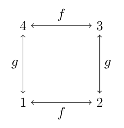

## Equivalence of algebraic structures

Consider two finite algebras that are the same
except for a relabeling of the operations.
Our intuition tells us that these are simply different names for the same
mathematical structure.
Formally, however, not only are these distinct mathematical objects, but also
they are nonisomorphic.

*Isotopy* is another well known notion of "sameness" that is 
broader than isomorphism. However, I recently proved a result that
shows why isotopy also fails to fully capture algebraic equivalence. 

<!-- more -->

--8<-- "dated.md"

This post provides a little bit of background and motivation, with a
couple of examples of the problems that arise when trying to decide whether two 
algebraic objects are "equivalent."

------------------------------------------------------------

## Example

Let us consider an example of two algebras that are the same 
except for the naming of their operations.  (This is an 
elaboration on Exercises 5.1 in
[Algebras, Lattices, Varieties](http://books.google.com/books/about/Algebras_lattices_varieties.html).)

Let $\mathbf{A}$ be an algebra of size 4 and label the elements of the universe $\{1,2,3,4\}$.
Suppose $\mathbf{A}$ has two unary operations, $f^ \mathbf{A}$ 
and $g^ \mathbf{A}$, where $f^ \mathbf{A}$ is the permutation $(1,2)(3,4)$ and 
$g^ \mathbf{A}$ is the permutation $(1,3)(2,4)$.  

Thus, the operations permute the elements as follows:

The congruence lattice of $\mathbf{A}$ is 
$M_n$ whose universe is the set $\{ x_A , \theta_1, \theta_2, \theta_3, 1_A \}$. 
By abuse of notation, we identify the congruences with their corresponding
partitions as follows:

$$ 1_A = \mid 1,2,3,4 \mid $$

$$ \theta_1 = \mid 1, 2 \mid 3, 4 \mid \quad \theta_2 = \mid 1, 3 \mid 2, 4 \mid \quad \theta_3 =
\mid 1, 4 \mid 2, 3 \mid $$

$$0_A = \mid 1 \mid 2 \mid 3 \mid 4 \mid $$

Now consider the algebras 
$\mathbf{A}/\theta_1$,  $\mathbf{A}/\theta_2$, and $\mathbf{A}/\theta_3$ which have universes
$\{ \{1, 2\}, \{3, 4\}\}$, $\{ \{1, 3\}, \{2, 4\}\}$, and $\{ \{1, 4\}, \{2, 3\}\}$, respectively.

It is clear that $\mathbf{A} \cong \mathbf{A}/\theta_1 \times \mathbf{A}/\theta_2 \cong \mathbf{A}/\theta_1 \times\mathbf{A}/\theta_3 \cong \mathbf{A}/\theta_2
\times\mathbf{A}/\theta_3.$ 

Also, no two factors are isomorphic.  This is because of the naming of their
respective operations.

The algebra $\mathbf{A}/\theta_1$ has operations $f^{ \mathbf{A}/\theta_1}$ and
$g^{ \mathbf{A}/\theta_1}$, where $g^{ \mathbf{A}/\theta_1}$ permutes the blocks 
$\{1, 2\}\longleftrightarrow  \{3, 4\}$
and $f^{ \mathbf{A}/\theta_1}$ leaves them fixed.

On the other hand, the algebra $\mathbf{A}/\theta_2$ has operations $f^{ \mathbf{A}/\theta_2}$
and $g^{ \mathbf{A}/\theta_2}$, where $f^{ \mathbf{A}/\theta_2}$ permutes the blocks
$\{1, 3\} \longleftrightarrow \{2, 4\}$
and $g^{ \mathbf{A}/\theta_2}$ leaves them fixed.

Thus, the operation in $\mathbf{A}/\theta_1$ corresponding to the symbol $f$ is
the identity, while in $\mathbf{A}/\theta_2$ the $f$ symbol corresponds to the
nonidentity permutation. But apart from this trivial relabeling, these two
algebraic structures are the same. 

This may be viewed as a minor technical issue that could be overcome by simply
viewing the two algebras as *nonindexed algebras* (see, e.g.,
[Pol&aacute;k](http://dml.cz/dmlcz/106973)), and we can certainly say that
*up to a relabeling of the operation symbols,* the two algebras 
are isomorphic.

However, it would be preferable to have a notion of algebraic equivalence that
did not hinge on operation alignment.

---------------------------------------------------------------

## Deeper problems

The example above was a simple, almost trivial illustration of how the
notion of isomorphic (indexed) algebras fails to capture our intuitive
understanding of what it means for two algebras to be structurally the same.
But there are examples that go deeper and are not as easy to sidestep.

Consider the Oates-Powell Theorem [1](#references) which states that the variety
generated by a finite group has a finite equational basis. 

In a [1982 paper](https://github.com/williamdemeo/Isotopy/blob/master/pointedgroups.pdf?raw=true)
Roger Bryant proved that if we merely single out an element of the group and
giving it a label, then the resulting algebra (called a *pointed group*) generates
a variety that need not be finitely based.

---------------------------------------------------------------

## Isotopy

Any reasonable notion of algebraic equivalence should at least respect
congruence lattice structure.
The congruence relations of algebras are the kernels of homomorphisms, and the 
congruence lattice is a basic "algebraic" feature of an algebra. Certainly we
cannot accept a notion of "sameness" that equates two algebras with different
congruence lattices (putting aside for now what it means for two congruence
lattices to be "different").

*Isotopy*  provides a notion of "sameness" of
algebras that is less demanding than isomorphism, so there is some hope that 
it provides a reasonably intuitive notion of algebraic equivalence. 

But by the foregoing remark, if isotopy is to serve as a notion of algebraic
equivalence, we should at least demand that two isotopic algebras have the
"same" congruence lattices, and for two lattices to be the "same" in
any sense, they must have the same number of elements so that we can at least
find a bijection between them (even if it is not a "structure preserving"
bijection).

However, I recently proved that, for any number $N \in \mathbb{N}$, it's easy to
construct a pair of isotopic algebras with congruence lattices that differ in
size by more than $N$ elements.  We see from this that there is no hope for
isotopy as a reasonable notion of algebraic equivalence.  (A link to my short
article describing the construction appears below.)

Later, we will explore Voevodsky's *univalence* principle and try 
to write down the definitions of universal algebras as higher types so that we
can exploit the ideas of homotopy type theory in order to possibly arrive at a 
more useful, intuitionistic definition of algebraic equivalence.

------------------------------------------------------------

## Open GitHub repository

The [Isotopy GitHub repository](https://github.com/williamdemeo/Isotopy)
contains
[my article](https://github.com/williamdemeo/Isotopy/blob/master/Isotopy.pdf?raw=true)
in which I present isotopic algebras with congruence lattices that are vastly
different in size.

-------------------------------------------------------------

## References

+ [1] "Identical relations in finite groups," S. Oates, M. B. Powell, J. Algebra
(1965).  
+ [2] "The laws of finite pointed groups" R. M. Bryant, Bull. London Math. Soc,
14 (1982), 119-123. 
