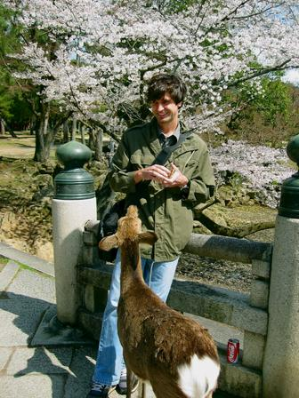

---
# Two things here look like they want to be tidied up, and both are load-bearing.
# (A YAML comment rather than an HTML one, for the reason docs/projects/index.md
# gives: front matter is parsed and discarded, an HTML comment ships.)
#
# 1. The "what I'm working on now" block is a bold, dated lead-in rather than an
#    `## h2`.  `.md-typeset h2` carries a full-width border-bottom and nothing
#    sets `clear`, so an h2 that begins while the portrait is still in flow
#    draws its rule behind the photo and leaves a stub of rule to the right of
#    it -- a block box is not shortened by a float, only its line boxes are.
#    Promoting this to an h2 reintroduces that unless the hero grows to about
#    nine lines or the portrait shrinks to about 100px.  See #18.
#
# 2. The portrait's width is a percentage, not a pixel count, and it is what
#    keeps the float from squeezing the prose to fifteen characters a line at
#    360px.  Both are why the first `h2` on the page is "Featured projects",
#    which starts below the float.
#
# The card order is a subset of ADR-006's, in ADR-006's relative order, and the
# tags are copied from docs/projects/index.md.  Neither is a per-page call.
title: William DeMeo
description: >-
  Mathematician and formal verification engineer working on machine-checked
  mathematics, interactive theorem proving in Agda, and AI tooling for proof
  assistants.
---

# William DeMeo

{ align=right width="30%" }

Mathematician by training with a PhD in universal algebra and lattice theory; 
formal verification engineer by trade.  I work on **machine-checked
mathematics**: proofs and production systems in Agda, and tooling that lets
language models work inside a proof assistant.

**What I'm working on now** (2026). The machine-checked specification of
the Cardano ledger in Agda, with the Formal Methods team at
[IO](https://iohk.io/), and
[agda-native-air](https://github.com/formalverification/agda-native-air),
making Agda's interaction protocol accessible to language models so they can
interact with the proof assistant they way humans do, rather than merely
type-checking complete proofs.

## Featured projects

**[AI for formal verification](https://github.com/formalverification/agda-native-air)**

An MCP server exposing Agda's interaction protocol to language models, and the
agent loops built on it.

`Agda`{.tag} `MCP`{.tag} `AI tooling`{.tag}

[Source](https://github.com/formalverification/agda-native-air)
{.project-links}

**[agda-algebras](projects/agda-algebras.md)**

The first constructive, machine-checked proof of Birkhoff's HSP theorem in
Martin-Löf type theory.

`Agda`{.tag} `type theory`{.tag} `universal algebra`{.tag} `setoids`{.tag}

[Source](https://github.com/ualib/agda-algebras) ·
[Docs](https://agda-algebras.universalalgebra.org)
{.project-links}

**[The Cardano ledger specification](projects/cardano-ledger.md)**

Formal methods at production scale: an Agda specification that must track a
system under active development.

`Agda`{.tag} `Haskell`{.tag} `formal methods`{.tag} `production`{.tag}

[Source](https://github.com/IntersectMBO/formal-ledger-specifications) ·
[Paper](https://drops.dagstuhl.de/entities/document/10.4230/OASIcs.FMBC.2024.2)
{.project-links}

**[Universal algebra and lattice theory](https://arxiv.org/abs/1204.4305)**

Congruence lattices of finite algebras, and the algebraic approach to
determining the complexity of constraint satisfaction problems.

`universal algebra`{.tag} `lattice theory`{.tag} `complexity`{.tag}

[Thesis](https://arxiv.org/abs/1204.4305) ·
[Papers](publications.md)
{.project-links}

The through-line across all four is an interest in what is *mechanizable*:
which structures admit effective procedures, and what it takes to make an
argument checkable by a machine rather than by a referee.

The full set is in [Projects](projects/index.md).

## Recent writing

<!-- recent-posts -->

More in the [blog](blog/index.md).

## Elsewhere

Before moving into industry I held research and teaching appointments at Charles
University in Prague, the University of Colorado Boulder, the University of
Hawaii, Iowa State University, and the University of South Carolina.  The
[CV](cv.md) has the full record and [about](about.md) has the longer version.

[Email](mailto:williamdemeo@gmail.com) ·
[GitHub](https://github.com/williamdemeo) ·
[Google Scholar](https://scholar.google.com/citations?user=y1OQ07QAAAAJ) ·
[ORCID](https://orcid.org/0000-0003-1832-5690) ·
[arXiv](https://arxiv.org/a/demeo_w_1) ·
[Publications](publications.md) ·
[Contact](contact.md)

!!! note "This site is still being rebuilt"

    Content is migrating here from a Zola site at
    [williamdemeo.org](https://williamdemeo.org) and an older Octopress site.
    The publications, the projects, and the blog have landed; talks, teaching,
    a research narrative, and the graduate qualifying-exam solutions have not.
    Progress is tracked in
    [the issue tracker](https://github.com/williamdemeo/williamdemeo.github.io/issues).
