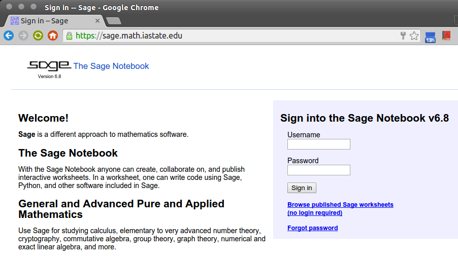
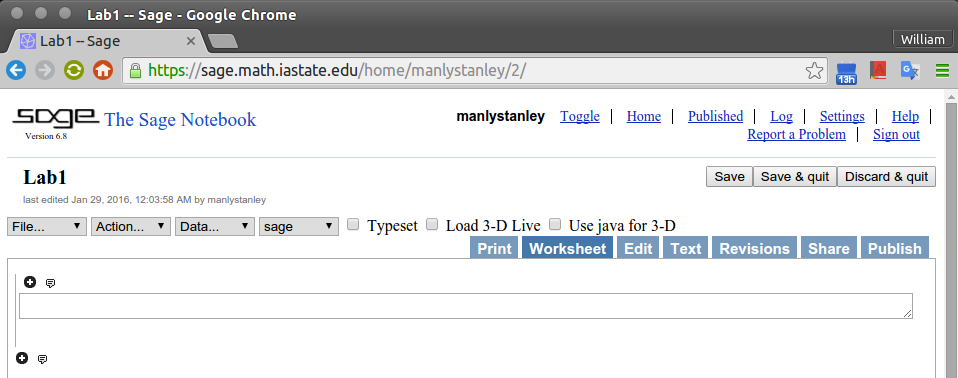

--8<-- "archived.md"

## Part 1 Summary 

(More detailed instructions are below.)

1. **Sign up for an account on the Math Department Sage server**

2. **Demonstrate that you know how to compute $2\times 2$.** 

3. **When you finish Part 1, have the instructor sign your paper to record completion.**

   Completing Part 1 is worth 1 point. If you are not interested in completing Part 2 of the assignment, you may turn in your paper and leave the lab after completing Part 1.

   **Make sure your name is on your paper and it was signed by the instructor.**

## Part 2 Summary 

(More detailed instructions are below.)

Complete the exercises in Part 2 following the instructions provided below, then save your Sage worksheet as a .sws file and upload this file on Blackboard.

## Finishing 

When you have finished working or it is 2pm (whichever comes first):

1. **stop your Sage worksheet** (Action $\rightarrow$ Save and quit worksheet; or use Stop button),

2. **sign out of Sage**

3. **logout of your computer**

4. **write your name on your paper**

5. **hand it in to the instructor**

---

## Part 1 Details

1. Login to any machine in Carver 449, open up a browser (preferably Chrome) and navigate to [https://sage.math.iastate.edu/](https://sage.math.iastate.edu/)

    You should arrive at a page that looks like this:

    

2. Using your Iowa State username and a password supplied by your instructor, login to your Sage account.

3. Once you are logged in, select the New Worksheet link and name the worksheet Lab1.

   If all went well, you will now see a page that looks like this:

   

4. Click somewhere inside the wide rectangular box (or “cell”) and type the expression 2\*2. Then type Shift+Enter (hold down the Shift key and press Enter; or simply click ‘evaluate‘).

    If a 4 appears in the worksheet, congratulations on completing Part 1. Ask the instructor to check your work and sign below, then do Part 2 (or Save & quit if you want to stop here):\
    \
    \
    Instructor signature: (1 point)

---

## Part 2 Details

In this part we will use Sage to help solve the following exercise from the textbook:

By solving a system of equations, write the vector $\mathbf b = \begin{bmatrix} 3 \\\\ 0 \\\\ -2 \end{bmatrix}$ as a linear combination of the vectors $$\mathbf v_1 = \begin{bmatrix} 1 \\\\ 0 \\\\ -1 \end{bmatrix}, \quad \mathbf{v}_2 = \begin{bmatrix} 0 \\\\ 1 \\\\ 2 \end{bmatrix}, \quad \text{ and } \quad \mathbf v_3 = \begin{bmatrix} 2 \\\\ 1 \\\\ 1 \end{bmatrix}.$$

To write the vector $\mathbf{b}$ as a linear combination of the vectors $\mathbf{v}_1$, $\mathbf{v}_2$, and $\mathbf{v}_3$, we must find coefficients $x_1, x_2, x_3$ such that
$\mathbf{b}= x_1 \mathbf{v}_1 +  x_2 \mathbf{v}_2 + x_3 \mathbf{v}_3$. As we discussed in lecture, this is equivalent to finding a vector $\mathbf{x}= (x_1, x_2, x_3)$ such that
$A\mathbf{x}= \mathbf{b}$, where $A$ is the matrix whose columns are the vectors $\mathbf{v}_1$, $\mathbf{v}_2$, and $\mathbf{v}_3$.

In Sage, we will construct the matrix $A$ and then augment this matrix with the vector $\mathbf{b}$. Finally we will solve for $\mathbf{x}$ by putting the augmented matrix in echelon form. We'll
make Sage do all the tedious work, but it will be up to us to interpret Sage's output and write down a correct solution.

1. First, we need to learn how to enter the matrix $$A = \begin{bmatrix} 1 &0&2\\\\ 0&1&1\\\\-1&2&1\end{bmatrix}$$ in Sage. In your Lab1 Sage worksheet, click the **Help** link at the top right. A help window should appear (possibly in a pop-up window). On the Help page, navigate through the following links:

   **Reference Manual** $\rightarrow$ **modules** $\rightarrow$ **m** $\rightarrow$ **sage.matrix.constructor**

   From the help page that appears, you should be able to discern how to input the matrix $A$ in Sage. (Hint: you should start with `A = matrix([[1,0,2],...`

   After entering the matrix, type Shift+Enter to evaluate your input. To confirm that Sage correctly interpreted your input, enter the single character `A` in a new cell and then Shift+Enter.

2. Next, input the vector $\mathbf{b}= (3, 0, -2)$ using the following syntax: `b = vector([3,0,-2])`

   At this point, you are half way done with Part 2. Ask the instructor to check your work.\
    \
    \
    Instructor signature: (1/2 point)

3. Next, we want to construct the augmented matrix $$[A|\mathbf{b}] = \left[\begin{array}{rrr|r} 1&0&2&3\\\\ 0&1&1&0\\\\-1&2&1&-2\end{array}\right].$$ Using a search engine (e.g., Google) search for the phrase "sage augmented matrix." The first result will probably be to the Sage Reference Manual page matrices/sage/matrix/matrix1.html.

   Read a bit of this page and see if you can figure out how to use the `augment()` function (or "method") of the matrix object `A`. You will use `b` as the input to the `augment()` method.

   Don't forget to give a name to the augmented matrix, e.g., `Ab = augment...` and then check that Sage correctly interpreted your input (by typing `Ab` then `Shift`+`Enter`.)

4. Next, put your augmented matrix in echelon form. Again, try to use the Sage help pages or a Google search to figure out how to do this. If you need help, ask the instructor.

5. Finally, interpret the Sage output of the `echelon_form` command and write down a solution.

   The solution vector is $\mathbf{x}=$\
   \
   \
   ...so $\mathbf{b}= (3, 0, -2)$ can be written as the following linear combination: $\mathbf{b}= \underline{\phantom{XXX}}\mathbf{v}_1 + \underline{\phantom{XXX}} \mathbf{v}_2+ \underline{\phantom{XXX}} \mathbf{v}_3$ (fill in the blanks).

   **You have now completed Part 2.** 

   You should take this opportunity to use Sage to check your final answer. One way to do this is to type your solution vector into Sage (with `x = vector(...)` and then compute `A*x`. Does this result in the vector $(3, 0, -2)$? Alternatively, you could simply ask Sage to solve the system for you with the `solve_right` command!

A tutorial describing how to do more linear algebra in Sage is available at [http://doc.sagemath.org/html/en/tutorial/tour_linalg.html](http://doc.sagemath.org/html/en/tutorial/tour_linalg.html)\
\
\
Instructor signature: (1/2 point)
