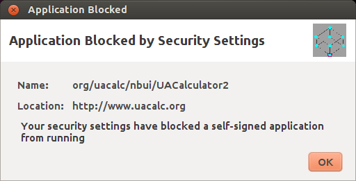
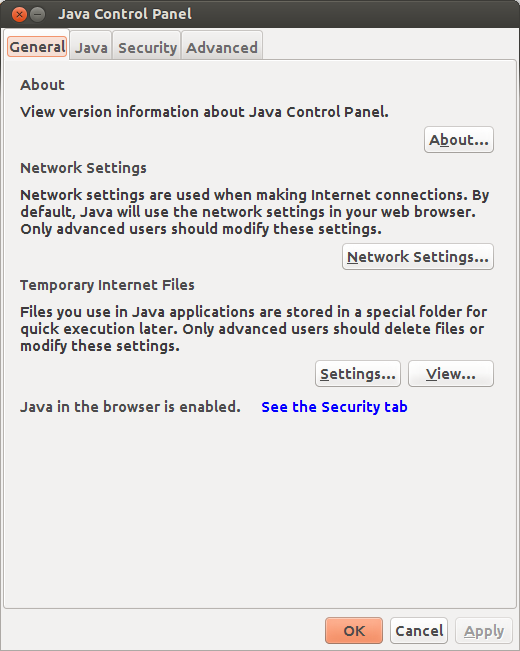
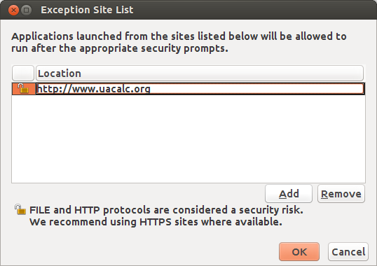
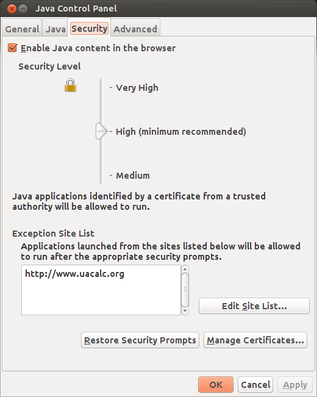
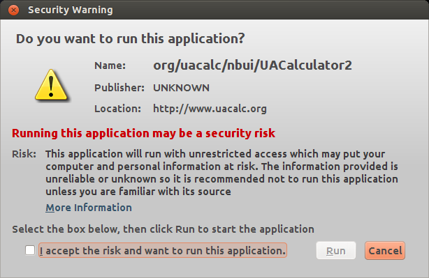
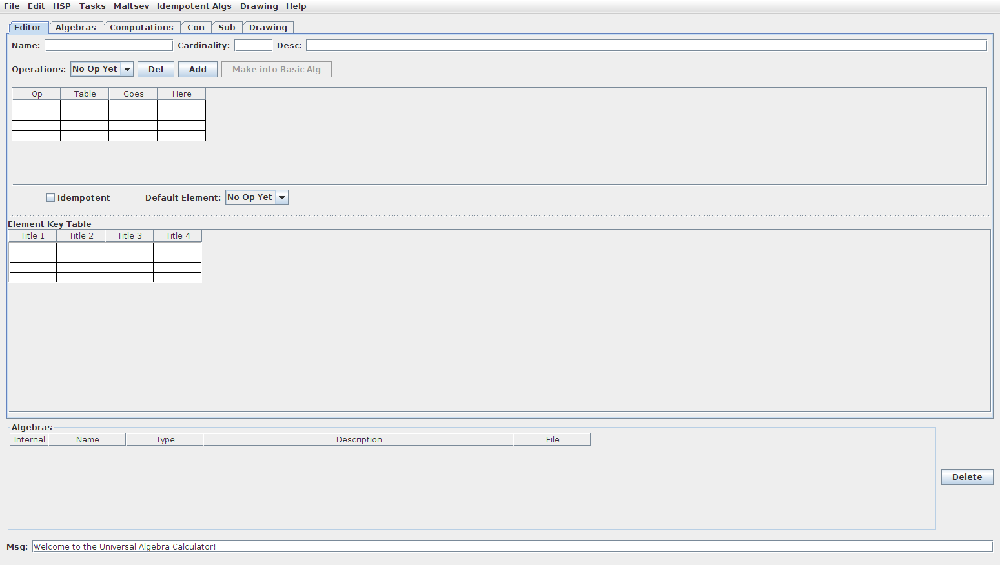

This page is a guide to some aspects of configuring and using the [Universal Algebra Calculator][] (UACalc). The main web site for UACalc is [uacalc.org][].

Most of the instructions here are aimed at Linux users. If you use 
another operating system, feel free to use these notes as a guide.

-----------------------------------------------------

## Table of Contents

+ [UACalc at the command line](#uacalc-at-the-command-line)
+ [Launching the UACalc GUI](#launching-the-uacalc-gui)
  - [Install Java](#install-java)
  - [Add UACalc to Exceptions List](#add-uacalc-to-java-security-exceptions-list)
  - [Launch UACalc](#launch-uacalc)

--------------------------------------------
--------------------------------------------

## UACalc at the command line

+ [Example: search for algebraic structures with certain properties](command-line-examples)
+ [GitHub repository for the command line version of UACalc](https://github.com/UACalc/UACalc)
+ [Notes about various ways to use the UACalc from the command](http://universalalgebra.wordpress.com/documentation/uacalc/)

-------------------------------------------------------
-------------------------------------------------------

## Launching the UACalc GUI

The standard way to use the UACalc is through its graphical user interface.
This requires Java.  There are many ways to get the Java Runtime Environment 
working on a Linux machine, but here we describe how to install the full
Oracle Java Development Kit (JDK).  This is a reasonable option, especially if you 
plan to venture beyond the GUI, and write some Java or Jython or Scala programs 
that call UACalc Java packages.

-------------------------------

### Install Java
Here is one way to install Java on Ubuntu Linux. It is not the only way, but it seems to work.  (Alternative instructions for installing the JDK on Linux are [here](http://docs.oracle.com/javase/7/docs/webnotes/install/linux/linux-jdk.html).)

1. **Download the Java Development Kit**  

   As of this writing (28 Sep 2020) the latest version of the JDK is 15, which is available at
   
   [www.oracle.com/java/technologies/javase-downloads.html](https://www.oracle.com/java/technologies/javase-downloads.html)

   For example, I'm currently using [jdk-15_linux-x64_bin.tar.gz](https://www.oracle.com/java/technologies/javase-jdk15-downloads.html#license-lightbox), but you should pick the distribution that is most appropriate for your hardware and OS.

2. **Unpack the jdk tarchive** with `tar xvzf jdk-*.tar.gz` (on the [cli] from inside the directory where you downloaded the jdk)

3. **Create the jvm directory** with `sudo mkdir -p /usr/lib/jvm`.
 
4. **Move the jdk directory** with `sudo mv jdk-15 /usr/lib/jvm/
	
5. **Make jdk-15 the default Java**

   We will use the `update-alternatives` program for this step.
   
   (see also: [notes on configuring JDK 1.7 on Ubuntu](http://askubuntu.com/questions/55848/how-do-i-install-oracle-java-jdk-7)):

   This first block of 7 commands can be copy-and-pasted to the command line all at once:
		
        sudo update-alternatives --install "/usr/bin/java" "java" "/usr/lib/jvm/jdk-15/bin/java" 1;
        sudo update-alternatives --install "/usr/bin/javac" "javac" "/usr/lib/jvm/jdk-15/bin/javac" 1;
		sudo update-alternatives --install "/usr/bin/jcontrol" "jconsole" "/usr/lib/jvm/jdk-15/bin/jconsole" 1;
        sudo chmod a+x /usr/bin/java;
        sudo chmod a+x /usr/bin/javac;
        sudo chmod a+x /usr/bin/jconsole;
        sudo chown -R root:root /usr/lib/jvm/jdk-15;

   The following commands are interactive and should be invoked individually:
		
        sudo update-alternatives --config java
        sudo update-alternatives --config javac
        sudo update-alternatives --config jconsole

You can check which version of Java your system is currently using with the command`java -version`.

------------------------------------------------------

### Add UACalc to Java Security Exceptions List

(As of March 2014, the Java security certificate for the UACalc has been
renewed, so it shouldn't be necessary to follow all of the steps in this
section. After installing Java as described above, and then following steps 1
and 2 below, the UACalc gui should run fine. However, I'll leave the information
in this section as is, in case Ralph decides it's not worth renewing the
security certificate in the future.)

In an ideal world, assuming you successfully installed Java as described in 
the previous step, you would now be able to go to [uacalc.org][] 
and click a `Launch` button.  However, the world is not idea, and launching
UACalc for the first time now requires an extra step.
We must first tell Java that we trust the site www.uacalc.org.
(This used to be a simple matter of checking a box, but Oracle has 
recently made the procedure for accepting security certificates even 
more annoying.)

1. **Get the uacalc.jnlp file**  
   Go to [uacalc.org][] and download the uacalc.jnlp file that is most 
   appropriate for your hardware.  For example, if your machine has 8Gb 
   of RAM, you probably want
   [uacalcbig8.jnlp](http://www.uacalc.org/uacalcbig8.jnlp).

------------------------------------------------------

2. **Try to launch the UACalc gui** (and probably fail)  
   In a terminal window, go to the directory where you downloaded the file 
   in the previous step and try to launch UACalc with the following 
   command:

        javaws uacalcbig4.jnlp

   If UACalc starts up, you're good to go!  More than likely, however,
   you will get an annoying dialog box like the following:
   
   
   
   Where is the checkbox on this dialog so that I can accept the risk and 
   proceed at my own peril?  It's gone. So we have no choice but to
   select the `OK` button to abort launch and follow the steps below.

------------------------------------------------------

3. **Launch the Java Control Panel**  
   At the command line, type `jcontrol`
   You should see a window that looks like this:

   
   
   If you get an error, try typing `/usr/lib/jvm/jdk1.7.0/bin/jcontrol`
   
------------------------------------------------------

4. **Add uacalc.org to the Exception Site List**  
   Click on the `Security` tab, and click the `Edit Site List` button. 
   You should see a dialog box that looks like this:
   
   
   
   Click the `Add` button and type http://www.uacalc.org and click `OK`.

   You will get a warning.  Click `Continue`.  
   
   If your Java Control Panel now looks like the one below, click `OK`.
   
   
   
   
------------------------------------------------------

### Launch UACalc
   Now, when you invoke 

        javaws ~/Desktop/uacalc/uacalcbig4.jnlp
   
   at the command line, you should see a less futile and pointless window 
   than the one we saw in Step 2.
   
   
   
   Accept the risks and click `OK` and you should finally see the 
   UACalc gui, which looks like this:

   
   

[uacalc.org]: http://www.uacalc.org
[Universal Algebra Calculator]: http://www.uacalc.org

